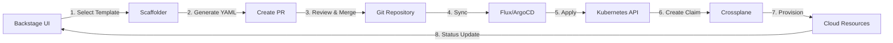

# Open Service Portal: Modern Cloud-Native Service Marketplace Architecture

## Executive Summary

This document outlines a comprehensive architecture for building a modern, cloud-native service marketplace using Backstage as the developer portal, Crossplane for infrastructure orchestration, and Kubernetes as the control plane. Based on current industry best practices and validated patterns from the platform engineering community.

## 1. Core Architecture Components

### 1.1 Technology Stack

The platform leverages proven CNCF technologies and community best practices:

| Component | Technology | Purpose | Sources |
|-----------|------------|---------|---------|
| **Developer Portal** | Backstage | Unified frontend for service discovery and provisioning | [Backstage.io](https://backstage.io/) |
| **Infrastructure Orchestration** | Crossplane | Cloud-native control plane for infrastructure | [Crossplane.io](https://www.crossplane.io/) |
| **Control Plane** | Kubernetes | API-driven orchestration platform | Industry standard |
| **GitOps** | Flux/ArgoCD | Declarative deployment and configuration management | [CNCF GitOps](https://www.cncf.io/blog/2021/05/13/gitops-101/) |
| **Template Discovery** | TeraSky Plugins | Automatic XRD to template generation | [TeraSky OSS](https://github.com/terasky-oss/backstage-plugins) |

### 1.2 Architecture Principles

1. **Everything as Code**: All infrastructure and services defined declaratively
2. **API-First**: Kubernetes CRDs as the single source of truth
3. **Self-Service**: Developers can provision services without platform team intervention
4. **GitOps-Driven**: All changes tracked and deployed through Git
5. **Cloud-Agnostic**: Abstract cloud specifics behind Crossplane providers

## 2. Service Hierarchy and Ownership Model

### 2.1 Service Layers

Based on best practices for platform engineering, services are organized in three layers:

```yaml
# Layer 1: Infrastructure Services (Platform Team)
- Kubernetes Clusters
- DNS Management
- TLS Certificates
- Firewall Rules
- Network Policies

# Layer 2: Component Services (Domain Teams)
- PostgreSQL Database
- MongoDB
- Kafka Messaging
- Redis Cache
- S3-compatible Storage

# Layer 3: Complex Services (Product Teams)
- ML/AI Platforms
- Development Environments
- CI/CD Pipelines
- Monitoring Stacks
```

### 2.2 Service Owner Responsibilities

Each service has a dedicated owner responsible for:
- Defining the service API (CRD)
- Creating Crossplane Compositions
- Maintaining documentation
- Setting SLAs and support levels
- Managing lifecycle and updates

## 3. Backstage Integration Strategy

### 3.1 Template Generation Approaches

Based on the 80/20 rule observed in enterprise deployments:

#### Automatic Generation (80% of services)
Using TeraSky's Kubernetes Ingestor plugin for simple services:
- Automatically discovers Crossplane XRDs
- Generates Backstage templates from OpenAPI schemas
- Supports basic field types, validations, and enums
- Best for standardized services with simple configuration

**Source**: [TeraSky Kubernetes Ingestor](https://github.com/TeraSky-OSS/backstage-plugins/tree/main/plugins/kubernetes-ingestor)

#### Manual Template Creation (20% of services)
For complex services requiring:
- Conditional UI logic (if X then show Y)
- Dynamic dropdowns with external data
- Multi-step wizards
- Complex validation rules
- Custom React components

### 3.2 Plugin Ecosystem

Essential Backstage plugins for the marketplace:

```typescript
// Core Plugins (Community)
import('@backstage/plugin-catalog-backend')
import('@backstage/plugin-scaffolder-backend')
import('@backstage/plugin-kubernetes-backend')
import('@backstage/plugin-catalog-backend-module-github')

// TeraSky Plugins for Crossplane Integration
import('@terasky/backstage-plugin-kubernetes-ingestor')
import('@terasky/backstage-plugin-crossplane-resources-frontend')
import('@terasky/backstage-plugin-scaffolder-backend-module-terasky-utils')

// Monitoring & Cost Management
import('@backstage/plugin-grafana')
import('@backstage/plugin-cost-insights')
```

## 4. Crossplane Architecture

### 4.1 Composition Pattern

Crossplane Compositions provide the abstraction layer between user-facing APIs and infrastructure:

```yaml
apiVersion: apiextensions.crossplane.io/v1
kind: Composition
metadata:
  name: postgresql-aws
spec:
  compositeTypeRef:
    apiVersion: database.platform.io/v1
    kind: PostgreSQLInstance
  resources:
    - name: rds-instance
      base:
        apiVersion: rds.aws.crossplane.io/v1alpha1
        kind: DBInstance
        spec:
          forProvider:
            region: eu-central-1
            engine: postgres
            engineVersion: "15"
    - name: dns-record
      base:
        apiVersion: dns.platform.io/v1
        kind: DNSRecord
        spec:
          forProvider:
            type: CNAME
    - name: firewall-rule
      base:
        apiVersion: network.platform.io/v1
        kind: FirewallRule
```

### 4.2 Provider Architecture

Crossplane providers enable multi-cloud support:
- AWS Provider for EKS, RDS, S3
- Azure Provider for AKS, Azure Database
- GCP Provider for GKE, Cloud SQL
- Terraform Provider for legacy resources
- Helm Provider for Kubernetes applications

**Source**: [8 Reasons Why Crossplane is Ideal for IDPs](https://blog.upbound.io/why-crossplane-is-the-ideal-engine-for-internal-developer-platforms)

## 5. Service Discovery and Catalog Management

### 5.1 Discovery Methods

Multiple discovery patterns for comprehensive catalog population:

1. **Kubernetes Discovery** (TeraSky Ingestor)
   - Automatically discovers Crossplane Claims and XRDs
   - Creates Backstage entities from Kubernetes resources
   - Updates in real-time as resources change

2. **GitHub Discovery** (Native Backstage)
   - Scans repositories for `template.yaml` files
   - Pattern matching: `service-*-template`
   - Scheduled synchronization every 30 minutes

3. **Manual Registration**
   - For external services or legacy systems
   - Static YAML definitions in Git

### 5.2 Catalog Entity Types

```yaml
# Software Template (for provisioning)
apiVersion: backstage.io/v1alpha1
kind: Template
metadata:
  name: postgresql-template
spec:
  type: service
  owner: platform-team

# Component (provisioned service)
apiVersion: backstage.io/v1alpha1
kind: Component
metadata:
  name: postgres-prod-teamx
spec:
  type: database
  lifecycle: production

# Resource (infrastructure)
apiVersion: backstage.io/v1alpha1
kind: Resource
metadata:
  name: postgres-claim-xyz
spec:
  type: crossplane-claim
```

## 6. Provisioning Workflow

### 6.1 GitOps-Driven Provisioning



### 6.2 Direct Provisioning (Development)

For development environments, optional direct provisioning:
```typescript
// Scaffolder action for direct kubectl apply
async function createCrossplaneClaim(ctx) {
  const manifest = generateClaimYAML(ctx.input.values);
  await kubectl.apply(manifest, { 
    namespace: ctx.input.namespace 
  });
}
```

## 7. Day-2 Operations Strategy

### 7.1 Hybrid Approach

Based on complexity and requirements:

| Operation Type | Implementation | Rationale |
|----------------|----------------|-----------|
| **View Status** | Backstage K8s Plugin | Native integration, real-time updates |
| **Simple Updates** | Backstage Forms | Parameter changes, scaling |
| **Complex Management** | Service-Specific UIs | Domain-specific operations |
| **Monitoring** | Grafana Plugin | Embedded dashboards |
| **Cost Tracking** | Cost Insights Plugin | FinOps visibility |

### 7.2 Resource Transparency

The Kubernetes plugin provides full visibility:
- Claim status and conditions
- All managed resources (via ownerReferences)
- Resource dependency graph
- Cost-relevant resources (VMs, databases, storage)

## 8. Security and Multi-Tenancy

### 8.1 RBAC Strategy

```yaml
# Namespace-based isolation
apiVersion: rbac.authorization.k8s.io/v1
kind: Role
metadata:
  namespace: team-alpha
  name: service-provisioner
rules:
  - apiGroups: ["database.platform.io"]
    resources: ["postgresqlinstances"]
    verbs: ["create", "update", "delete", "get", "list"]
```

### 8.2 Secret Management

- Crossplane manages provider credentials centrally
- Connection secrets propagated to user namespaces
- Integration with external secret stores (Vault, AWS Secrets Manager)
- Backstage only displays masked values

## 9. Alternative Architectures Considered

### 9.1 Kratix by Syntasso

**Kratix** offers a Promise-based abstraction model with a community marketplace:
- **Pros**: Pre-built Promises, multi-cluster support, marketplace ecosystem
- **Cons**: Additional abstraction layer, smaller community
- **Source**: [Kratix Marketplace](https://github.com/syntasso/kratix-marketplace)

### 9.2 KubeVela with OAM

**KubeVela** implements the Open Application Model:
- **Pros**: Application-centric, works with Crossplane
- **Cons**: Additional complexity, primarily for applications not infrastructure
- **Source**: [PlatformCon 2024 Talk](https://2024.platformcon.com/talks/empowering-platform-engineering-unleashing-the-potential-of-kubevela-and-crossplane)

### 9.3 AWS KRO (Experimental)

**Kubernetes Resource Orchestrator** by AWS/Microsoft/Google:
- **Status**: Public experiment, not production-ready
- **Innovation**: Simpler syntax than Crossplane
- **Limitation**: Limited features compared to Crossplane
- **Source**: [InfoQ Coverage](https://www.infoq.com/news/2025/02/kube-resource-orchestrator/)

## 10. Implementation Roadmap

### Phase 1: Foundation
- [ ] Deploy Kubernetes control plane cluster
- [ ] Install Crossplane with essential providers
- [ ] Setup Backstage with core plugins
- [ ] Configure GitOps (Flux/ArgoCD)

### Phase 2: Basic Services
- [ ] Create infrastructure service CRDs (DNS, TLS)
- [ ] Implement component services (PostgreSQL, Redis)
- [ ] Setup TeraSky Kubernetes Ingestor
- [ ] Test end-to-end provisioning

### Phase 3: Advanced Features
- [ ] Complex service templates with conditional UI
- [ ] Day-2 operations integration
- [ ] Cost management and showback
- [ ] Multi-environment support

### Phase 4: Production Readiness
- [ ] Policy enforcement (OPA/Kyverno)
- [ ] Disaster recovery procedures
- [ ] Performance optimization
- [ ] Documentation and training

## 11. Success Metrics

Key performance indicators for platform adoption:

| Metric | Target | Measurement |
|--------|--------|-------------|
| **Service Catalog Size** | 50+ services | Number of available templates |
| **Provisioning Time** | < 5 minutes | Time from request to ready |
| **Self-Service Rate** | > 90% | Requests without platform team |
| **Developer Satisfaction** | > 4.5/5 | Quarterly survey |
| **MTTR** | < 30 minutes | Time to resolve issues |

## 12. Conclusion

This architecture combines industry best practices with proven technologies to create a scalable, developer-friendly service marketplace. The combination of Backstage's UI capabilities, Crossplane's infrastructure orchestration, and Kubernetes' API-driven approach provides a solid foundation for internal platform engineering.

## References

1. [Backstage Software Catalog](https://backstage.io/) - CNCF Incubating Project
2. [Crossplane.io](https://www.crossplane.io/) - CNCF Incubating Project
3. [TeraSky Backstage Plugins](https://github.com/terasky-oss/backstage-plugins) - Open Source Kubernetes Integration
4. [Platform Engineering with Backstage](https://www.javacodegeeks.com/2025/06/platform-engineering-with-backstage-build-your-internal-developer-portal.html) - Guide
5. [Why Crossplane for IDPs](https://blog.upbound.io/why-crossplane-is-the-ideal-engine-for-internal-developer-platforms) - Upbound Blog
6. [GitOps with ArgoCD and Flux](https://www.cncf.io/blog/2021/05/13/gitops-101/) - CNCF Best Practices
7. [Kratix Platform Engineering Framework](https://www.kratix.io/) - Syntasso
8. [KRO Introduction](https://aws.amazon.com/blogs/opensource/introducing-open-source-kro-kube-resource-orchestrator/) - AWS/Microsoft/Google Collaboration
9. [KubeVela and Crossplane Integration](https://2024.platformcon.com/talks/empowering-platform-engineering-unleashing-the-potential-of-kubevela-and-crossplane) - PlatformCon 2024

---
*Document Version: 1.0*  
*Status: Draft for Review*