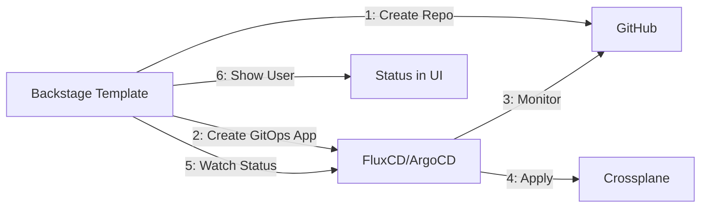
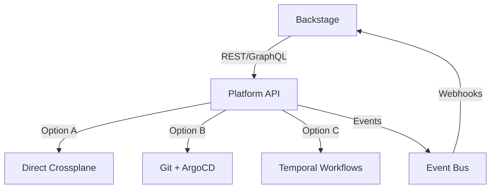

# Architecture Options: Detailed Analysis

**Date**: 2025-08-14  
**Status**: Analysis Document  
**Related**: [Platform Architecture Proposal](./2025-08-14-platform-architecture-decision.md)

## Executive Summary

This document provides detailed analysis of all architecture options considered for integrating Backstage with Crossplane for resource provisioning. Based on this analysis, we recommend **Option 2 (GitOps) + Option 3A (Immediate Feedback)** as the optimal solution.

## Current State Assessment

### What We Have ✅
- Backstage template creates GitHub repository with Kubernetes manifests
- Unique suffix generation for resource naming (e.g., `mongodb-3a4f75ae`)
- Catalog entities registered in Backstage
- Infrastructure-as-Code templates ready

### What's Missing ❓
- Actual resource provisioning in Kubernetes/Cloud
- Connection between Git repository and Crossplane
- Day-2 operations (updates, monitoring, deletion)
- Real-time feedback loop

---

## Option 1: Direct Apply (Backstage → Crossplane)

### Overview
Backstage directly applies resources to Kubernetes/Crossplane API during template execution.

### Implementation Details
```yaml
# In template.yaml add:
- id: apply-crossplane
  name: Apply Crossplane Resources
  action: kubernetes:apply  # Using @muvaf/kubernetes-apply
  input:
    manifest: |
      apiVersion: database.example.io/v1alpha1
      kind: MongoDB
      metadata:
        name: ${{ parameters.name }}-${{ steps['generate-suffix'].output.id }}
        namespace: ${{ parameters.namespace }}
      spec:
        storageSize: ${{ parameters.storageSize }}
        version: "7.0"
```

### Required Components
- **[@muvaf/kubernetes-apply](https://github.com/muvaf/kubernetes-apply)**: Custom action for kubectl apply
- **[@devangelista/backstage-scaffolder-kubernetes](https://www.npmjs.com/package/@devangelista/backstage-scaffolder-kubernetes)**: Comprehensive K8s actions
- Service Account with proper RBAC permissions
- Direct cluster connectivity from Backstage

### Pros ✅
- **Immediate provisioning**: Resources created instantly
- **Simple feedback loop**: Direct success/failure in UI
- **No external dependencies**: Single system to manage
- **Real-time status**: Can query resource status immediately

### Cons ❌
- **Tight coupling**: Backstage needs cluster access
- **No GitOps trail**: Changes bypass Git history
- **Scalability concerns**: Backstage becomes critical path
- **Rollback complexity**: No built-in rollback mechanism
- **Security implications**: Backstage needs broad permissions

### Best For
- PoC/Development environments
- Small teams with simple requirements
- Quick iterations and experiments

### 2025 Reference Implementation
[vRabbi's Backstage-Crossplane Integration](https://vrabbi.cloud/post/integrating-backstage-with-crossplane/) shows this pattern with custom plugins.

### Why We Rejected This Option
- Violates GitOps principles
- Security concerns with direct cluster access
- No audit trail for compliance
- Industry experts universally recommend against this

---

## Option 2: Pure GitOps (Backstage → Git → GitOps Tool → Crossplane)

### Overview
Backstage creates Git repository, GitOps controller (Flux/ArgoCD) monitors and applies changes.

### Implementation with FluxCD
```yaml
# flux/clusters/production/apps/mongodb-services.yaml
apiVersion: kustomize.toolkit.fluxcd.io/v1
kind: Kustomization
metadata:
  name: mongodb-services
  namespace: flux-system
spec:
  interval: 5m
  path: "./manifests"
  prune: true
  sourceRef:
    kind: GitRepository
    name: mongodb-services
  targetNamespace: mongodb-system
---
apiVersion: source.toolkit.fluxcd.io/v1
kind: GitRepository
metadata:
  name: mongodb-services
  namespace: flux-system
spec:
  interval: 1m
  url: https://github.com/open-service-portal/${service-name}
  ref:
    branch: main
```

### Implementation with ArgoCD
```yaml
# argocd/applications/mongodb-app-of-apps.yaml
apiVersion: argoproj.io/v1alpha1
kind: Application
metadata:
  name: mongodb-services
  namespace: argocd
spec:
  project: default
  source:
    repoURL: https://github.com/open-service-portal
    targetRevision: HEAD
    path: services/*/manifests
  destination:
    server: https://kubernetes.default.svc
  syncPolicy:
    automated:
      prune: true
      selfHeal: true
    syncOptions:
    - CreateNamespace=true
```

### ArgoCD v3 (2025) Features
- **Simplified repo management**: Single Git configuration
- **Annotation-driven tracking**: Better drift detection
- **Matrix generation**: Multi-environment management
- **App-of-Apps pattern**: Hierarchical application management

### Pros ✅
- **GitOps principles**: Everything tracked in Git
- **Audit trail**: Complete history of changes
- **Distributed teams**: Git as collaboration point
- **Auto-remediation**: Self-healing on drift
- **Progressive delivery**: Canary/blue-green deployments
- **Multi-cluster**: Easy multi-cluster deployment

### Cons ❌
- **Eventual consistency**: 1-5 minute delay for changes
- **Complex debugging**: Multiple systems involved
- **Repository proliferation**: Many repos to manage
- **Learning curve**: Teams need GitOps knowledge

### Best For
- Production environments
- Regulated industries (compliance)
- Large distributed teams
- Multi-cluster deployments

### 2025 Best Practice References
- [AWS Multi-Cluster GitOps](https://aws.amazon.com/blogs/containers/part-1-build-multi-cluster-gitops-using-amazon-eks-flux-cd-and-crossplane/)
- [GitOpsify Infrastructure with Crossplane](https://blog.upbound.io/gitopsify-infrastructure-xp)
- [Full GitOps with Crossplane & ArgoCD](https://codecentric.de/wissens-hub/blog/full-gitops-with-crossplane-and-argocd)

### Why We Chose This as Base
- Industry standard approach
- Full audit trail for compliance
- Scalable to enterprise needs
- Aligns with "Everything is a CRD" philosophy

---

## Option 3: Hybrid and Alternative Approaches

We evaluated several hybrid approaches that combine or extend the basic options:

### Option 3A: Immediate Feedback Enhancement

#### Overview
Adds real-time status feedback to Option 2 without compromising GitOps principles.

### Implementation Architecture


### Implementation Details
1. Template creates repository AND GitOps Application
2. Backstage polls GitOps tool for sync status
3. Shows real-time provisioning status to user
4. Uses webhooks for instant updates

### TeraSky Plugin Integration
```typescript
// Real-time status without separate UI
import { CrossplaneResourcesCard } from '@terasky/backstage-plugin-crossplane-resources';
import { FluxKustomizationCard } from '@roadie/backstage-plugin-flux';

// Shows instant feedback
<CrossplaneResourcesCard />
<FluxKustomizationCard />
```

### Pros ✅
- **Best of both worlds**: GitOps + good UX
- **No separate UI needed**: Everything in Backstage
- **Real-time feedback**: Users see progress
- **Maintains GitOps trail**: Full compliance

### Cons ❌
- **Slightly more complex**: Two systems to integrate
- **Plugin dependency**: Relies on TeraSky plugins

### Why We Added This
- Addresses main GitOps weakness (delayed feedback)
- vRabbi's production pattern
- Minimal additional complexity

---

### Option 3B: Platform API Abstraction (Considered but Rejected)

#### Overview
Custom API layer between Backstage and infrastructure.

#### Architecture


#### Components
- Custom Platform API (Go/Python)
- Abstracts provisioning complexity
- Supports multiple backends
- WebSocket/SSE for real-time updates

#### Why We Rejected This
- **Over-engineering**: TeraSky plugins solve this simpler
- **Maintenance burden**: Another component to maintain
- **No clear benefit**: Doesn't add value over Option 2+3A

---

### Option 3C: Crossplane Composition Functions (Future Enhancement)

#### Overview
Leverages Crossplane v2's composition functions for advanced logic.

#### Implementation
```yaml
apiVersion: apiextensions.crossplane.io/v1
kind: Composition
metadata:
  name: mongodb-golden-path
spec:
  compositeTypeRef:
    apiVersion: platform.io/v1
    kind: XMongoDBStack
  mode: Pipeline
  pipeline:
  - step: render-manifests
    functionRef:
      name: function-go-templating
  - step: auto-ready
    functionRef:
      name: function-auto-ready
  - step: patch-and-transform
    functionRef:
      name: function-patch-and-transform
```

#### Features
- Crossplane v2 composition functions
- More complex logic in provisioning
- Better status propagation
- Namespace-scoped resources (new in v2)

#### Timeline
- **Current**: Use Crossplane v1.17+ with traditional compositions
- **August 2025**: Migrate to v2 when stable
- **Benefits**: Simpler compositions, better debugging

---

### Option 3D: Event-Driven with Kratix (Alternative Platform)

#### Overview
[Kratix](https://kratix.io/) provides Platform-as-a-Product framework.

#### Implementation
```yaml
apiVersion: platform.kratix.io/v1alpha1
kind: Promise
metadata:
  name: mongodb-promise
spec:
  api:
    apiVersion: platform.io/v1
    kind: MongoDB
  dependencies:
  - name: crossplane
  workflows:
    resource:
      configure:
      - name: generate-manifests
```

#### Why We Didn't Choose This
- **Less mature**: Newer than Crossplane
- **Smaller community**: Less support available
- **Overlapping functionality**: Crossplane covers our needs

---

## Decision Matrix

| Criteria | Option 1 | Option 2 | Option 3A | Option 3B | Option 3C |
|----------|----------|----------|-----------|-----------|-----------|
| **GitOps Compliance** | ❌ | ✅ | ✅ | ✅ | ✅ |
| **Developer Experience** | ✅ | 🟡 | ✅ | ✅ | ✅ |
| **Implementation Complexity** | ✅ | ✅ | ✅ | ❌ | 🟡 |
| **Maintenance Burden** | ✅ | ✅ | ✅ | ❌ | ✅ |
| **Industry Alignment** | ❌ | ✅ | ✅ | 🟡 | 🟡 |
| **Scalability** | ❌ | ✅ | ✅ | ✅ | ✅ |
| **Security** | ❌ | ✅ | ✅ | ✅ | ✅ |
| **Available Now** | ✅ | ✅ | ✅ | ✅ | ❌ |

**Legend**: ✅ Good | 🟡 Acceptable | ❌ Poor

## Final Recommendation

### Chosen Architecture: Option 2 + 3A
**GitOps with FluxCD + Immediate Feedback via TeraSky Plugins**

### Rationale
1. **GitOps foundation** ensures compliance and scalability
2. **Immediate feedback** provides excellent developer experience
3. **TeraSky plugins** eliminate need for custom development
4. **FluxCD** aligns with "Everything is a CRD" philosophy
5. **Production proven** by vRabbi and community

### Migration Path
1. **Phase 1**: Implement Option 2 (Pure GitOps)
2. **Phase 2**: Add Option 3A (Immediate Feedback)
3. **Future**: Adopt Option 3C (Composition Functions) when Crossplane v2 stable

## References

### Industry Analysis
- [vRabbi's Backstage-Crossplane Integration](https://vrabbi.cloud/post/integrating-backstage-with-crossplane/)
- [DevOpsToolkit on Backstage](https://devopstoolkit.live/internal-developer-platforms/why-i-changed-my-mind-about-backstage)

### GitOps Best Practices
- [CNCF GitOps Principles](https://www.opengitops.dev/)
- [FluxCD Best Practices](https://fluxcd.io/flux/best-practices/)

### Crossplane Resources
- [Crossplane v2 Roadmap](https://crossplane.io/roadmap/)
- [Composition Functions](https://docs.crossplane.io/latest/concepts/composition-functions/)