# Platform Architecture Proposal: FluxCD + Backstage + Crossplane

**Date**: 2025-08-14  
**Status**: Proposed  
**Authors**: Platform Team

## Executive Summary

After comprehensive analysis and validation by industry experts (vRabbi, DevOpsToolkit), we propose the following platform architecture:

**Proposed Stack**: FluxCD + Backstage (self-hosted) + Crossplane v2  
**Proposed Pattern**: GitOps (Option 2) + Immediate Feedback (Option 3A)  
**Key Enabler**: TeraSky OSS Backstage Plugins for Auto-Template Generation

## Architecture Options Evaluated

We evaluated multiple architecture patterns for integrating Backstage with Crossplane. 

> **📚 For detailed analysis**: See [Architecture Options: Detailed Analysis](./2025-08-14-architecture-options-detailed-analysis.md)

### Quick Summary

| Option | Approach | Verdict |
|--------|----------|---------|
| **1: Direct Apply** | Backstage → kubectl → Crossplane | ❌ Rejected - No GitOps trail |
| **2: Pure GitOps** | Backstage → Git → FluxCD → Crossplane | ✅ Industry standard |
| **3: Hybrid Approaches** | Various combinations and enhancements | See sub-options below |
| **3A: Immediate Feedback** | Add real-time status to Option 2 | ✅ Enhances UX |
| **3B: Platform API** | Custom abstraction layer | ❌ Over-engineering |
| **3C: Composition Functions** | Crossplane v2 features | 🔜 Future (Aug 2025) |
| **3D: Event-Driven (Kratix)** | Alternative platform framework | ❌ Not needed |

### Our Proposal: Option 2 + 3A Hybrid ✅✅

**Best of both worlds**:
- **GitOps foundation** (Option 2): Full audit trail, security, scalability
- **Enhanced UX** (Option 3A): Real-time feedback via TeraSky plugins
- **No compromises**: Maintains GitOps principles while improving developer experience
- **Production validated**: Used by vRabbi and TeraSky in production

## Architecture Proposal

### Why This Architecture?

1. **"Everything is a CRD" Philosophy**
   - FluxCD: GitRepository, Kustomization = CRDs
   - Crossplane: XRDs, Compositions = CRDs
   - Perfect consistency, no extra APIs

2. **Industry Validated**
   - vRabbi: "GitOps tool like FluxCD" (first option!)
   - DevOpsToolkit: Backstage = "safe long-term choice"
   - Both: Crossplane + Backstage = Platform Engineering future

3. **Resource Efficient**
   - FluxCD: 220MB RAM vs ArgoCD: 768MB
   - No unused UI (teams don't need it)
   - 3x fewer resources for same outcome

## Proposed Architecture

```mermaid
graph TB
    subgraph "Developer Experience"
        Dev["👩‍💻 Developer"]
        BS["🎭 Backstage Portal<br/>+ TeraSky Plugins"]
    end
    
    subgraph "GitOps Layer (Option 2)"
        GH["📂 GitHub"]
        Flux["🔄 FluxCD<br/>220MB RAM<br/>Pure CRDs"]
    end
    
    subgraph "Infrastructure"
        XP["🎯 Crossplane v2<br/>Composition Functions"]
        K8s["☸️ Kubernetes"]
        Cloud["☁️ Cloud Resources"]
    end
    
    subgraph "Feedback Loop (Option 3A)"
        Notify["📢 Flux Notifications"]
        Status["📊 Resource Status"]
    end
    
    Dev -->|"1: Select Template"| BS
    BS -->|"2: Push to Git<br/>(Option 2)"| GH
    Flux -->|"3: Pull Changes"| GH
    Flux -->|"4: Apply CRDs"| XP
    XP -->|"5: Provision"| Cloud
    XP -->|"6: Deploy"| K8s
    
    Flux -->|"Events"| Notify
    Notify -->|"Webhook<br/>(Option 3A)"| BS
    XP -->|"Status"| Status
    Status -->|"Display<br/>(Option 3A)"| BS
    
    style Flux fill:#c8e6c9
    style BS fill:#f3e5f5
    style XP fill:#fce4ec
```



## Current State vs Target State

### What We Have ✅
- Backstage template creates GitHub repository with Kubernetes manifests
- Unique suffix generation for resource naming (e.g., `mongodb-3a4f75ae`)
- Catalog entities registered in Backstage
- Infrastructure-as-Code templates ready

### What's Missing ❓
- Actual resource provisioning in Kubernetes/Cloud
- Connection between Git repository and Crossplane
- Day-2 operations (updates, monitoring, deletion)
- Real-time feedback loop

### How This Proposal Fills the Gaps
- **FluxCD**: Connects Git to Kubernetes (Option 2)
- **TeraSky Plugins**: Provides real-time feedback (Option 3A)
- **Auto-templates**: Eliminates manual maintenance
- **Crossplane v2**: Handles cloud provisioning

## Implementation: MongoDB Golden Path Example

### 1. XRD with Auto-Template Generation

```yaml
apiVersion: apiextensions.crossplane.io/v1
kind: CompositeResourceDefinition
metadata:
  name: xmongodbs.database.platform.io
  labels:
    # Magic Label für Auto-Template Generation!
    terasky.backstage.io/generate-form: "true"
spec:
  group: database.platform.io
  names:
    kind: XMongoDB
    plural: xmongodbs
  versions:
  - name: v1alpha1
    schema:
      openAPIV3Schema:
        type: object
        properties:
          spec:
            type: object
            properties:
              storageGB:
                type: integer
                default: 10
              version:
                type: string
                default: "7.0"
```

### 2. Backstage Generates Template Automatically

```yaml
# NO manual template writing!
# kubernetes-ingestor plugin:
# 1. Reads XRD with label
# 2. Parses OpenAPI schema
# 3. Generates Backstage template
# 4. Developer can use immediately
```

### 3. FluxCD GitOps Workflow

```yaml
# Backstage erstellt in Template:
apiVersion: source.toolkit.fluxcd.io/v1
kind: GitRepository
metadata:
  name: mongodb-${instance}
  namespace: flux-system
spec:
  interval: 1m
  url: https://github.com/open-service-portal/mongodb-${instance}
---
apiVersion: kustomize.toolkit.fluxcd.io/v1
kind: Kustomization
metadata:
  name: mongodb-${instance}
  namespace: flux-system
spec:
  interval: 5m
  path: "./manifests"
  sourceRef:
    kind: GitRepository
    name: mongodb-${instance}
  healthChecks:
    - apiVersion: database.platform.io/v1alpha1
      kind: MongoDB
      name: mongodb-${instance}
```

### 4. Real-time Feedback in Backstage

```typescript
// TeraSky Plugins show status WITHOUT ArgoCD UI
import { CrossplaneResourcesCard } from '@terasky/backstage-plugin-crossplane-resources';
import { FluxKustomizationCard } from '@roadie/backstage-plugin-flux';

// In Entity Page:
<CrossplaneResourcesCard /> // Shows Crossplane resource status
<FluxKustomizationCard />   // Shows Flux sync status
```

## Why NOT ArgoCD?

| Aspect | FluxCD | ArgoCD |
|--------|--------|---------|
| **Architecture** | Pure CRDs | Extra API Layer |
| **UI** | Not needed | 500MB for nothing |
| **Resources** | 220MB RAM | 768MB RAM |
| **Philosophy** | K8s-native | Own abstraction |
| **vRabbi says** | First option! | Also possible |

**Our requirement**: "Teams shouldn't see the ArgoCD UI anyway"  
**Consequence**: FluxCD is the logical choice

## Why Self-Hosted Backstage?

**Roadie.io is not an option for us:**
- Need full control over customizations
- TeraSky Plugins installation
- Deep FluxCD/Crossplane integration
- Data sovereignty important

**Self-Hosted gives us:**
- Custom backend modules (e.g., `portal:utils:generateId`)
- Direct Kubernetes API integration
- FluxCD as GitOps for Backstage itself
- No vendor dependencies

## The TeraSky Game-Changer Plugins

### kubernetes-ingestor (7.6k downloads)
- **Auto-generates Templates from XRDs!**
- No more manual templates
- Always synchronized with infrastructure
- 90% less maintenance

### crossplane-resources (3.5k downloads)
- Visualization in Backstage
- Real-time status updates
- No ArgoCD UI needed

### Performance: 10x faster!
- Targeted API calls
- Partial rendering
- Production-ready with 1000+ resources

## Day-2 Operations


**Crossplane Claim Updater Plugin:**
- Holt aktuelle Werte aus Git
- Generiert Update-Form
- Erstellt PR mit Änderungen
- FluxCD applied automatisch

## Migration Path

### Phase 1: Foundation (Now)
```bash
# FluxCD Bootstrap
flux bootstrap github \
  --owner=open-service-portal \
  --repository=flux-config \
  --path=clusters/production

# Crossplane v2 Installation
helm install crossplane \
  --namespace crossplane-system \
  crossplane-stable/crossplane
```

### Phase 2: Backstage Enhancement (Immediately)
```bash
# TeraSky Plugins
yarn add @terasky/backstage-plugin-kubernetes-ingestor
yarn add @terasky/backstage-plugin-crossplane-resources

# Flux Notifications
kubectl apply -f flux-notifications-backstage.yaml
```

### Phase 3: Auto-Template Generation (Quick Win)
```bash
# Label XRDs
kubectl label xrd xmongodbs.database.platform.io \
  terasky.backstage.io/generate-form=true

# Configure Ingestor
# Adjust app-config.yaml
# Templates are generated automatically!
```

## Success Metrics

- ✅ Time to provision < 3 minutes
- ✅ Zero manual template maintenance
- ✅ 100% Git traceability  
- ✅ Resource usage < 250MB total
- ✅ Real-time status in Backstage
- ✅ Self-service Day-2 operations

## Cost-Benefit Analysis

### Time Savings
- **Template Creation**: 4-8h → 0 min per template
- **For 20 Services**: 160h saved
- **Day-2 Operations**: 80% faster
- **XRD Updates**: Automatically synchronized

### Resource Savings
- **FluxCD vs ArgoCD**: 548MB RAM saved
- **For 100 Stacks**: ~$30/month saved
- **No UI Maintenance**: Priceless

## Decision Validation

### Industry Experts
- **vRabbi**: FluxCD first choice, TeraSky Plugins production-ready
- **DevOpsToolkit**: GitOps principle > tool, Backstage = future

### Community Adoption
- kubernetes-ingestor: 7.6k downloads
- FluxCD: CNCF Graduated
- Crossplane: v2 with major improvements

## Risks & Mitigation

| Risk | Mitigation |
|------|-----------|
| Backstage Complexity | TeraSky Plugins drastically reduce effort |
| No UI for Debugging | kubectl + Flux CLI sufficient, Grafana dashboards |
| Plugin Maintenance | Active community, own forks possible |
| Performance | Already 10x optimized by vRabbi |

## Conclusion

**The proposal for FluxCD + Backstage + Crossplane is:**
- ✅ Technically correct (Everything is CRD)
- ✅ Industry validated (vRabbi, DevOpsToolkit)
- ✅ Resource efficient (3x less than alternatives)
- ✅ Future-proof (CNCF Graduated/Incubating)
- ✅ Developer-friendly (Auto-Templates!)

**With TeraSky Plugins, a good architecture becomes an excellent platform!**

---

## Appendix: Tool Versions

- FluxCD: v2.3+
- Backstage: v1.31+
- Crossplane: v1.17+ (v2 ab August 2025)
- TeraSky Plugins: Latest
- Kubernetes: v1.29+

## References

- [vRabbi: Backstage-Crossplane Integration](https://vrabbi.cloud/post/integrating-backstage-with-crossplane/)
- [DevOpsToolkit: Why I Changed My Mind About Backstage](https://devopstoolkit.live/)
- [FluxCD Documentation](https://fluxcd.io)
- [TeraSky OSS Plugins](https://github.com/terasky-oss)
- [Crossplane v2 Roadmap](https://crossplane.io)