# GitOps Workflow: FluxCD + Backstage + Crossplane

**Date**: 2025-08-14  
**Replaces**: [2025-08-13-gitops-workflow-diagram.md](./2025-08-13-gitops-workflow-diagram.md)

## Overview

Clear, modern platform architecture with FluxCD as GitOps engine, Backstage as developer portal, and Crossplane for infrastructure provisioning.

## Architecture Diagram


## Key Innovations

### 1. Auto-Generated Templates 🎯

**No more manual template writing!**

```yaml
# Just add this label to your XRD:
metadata:
  labels:
    terasky.backstage.io/generate-form: "true"

# kubernetes-ingestor plugin:
# - Reads XRD OpenAPI Schema
# - Generates Backstage Template automatically
# - Always in sync with infrastructure!
```

### 2. Pure CRD Architecture 🏗️

```bash
# Everything is a Kubernetes CRD:
kubectl get gitrepositories        # FluxCD sources
kubectl get kustomizations          # FluxCD deployments
kubectl get mongodbs               # Crossplane claims
kubectl get compositions           # Crossplane definitions

# One tool to rule them all: kubectl!
```

### 3. Resource Efficiency 💚

| Component | Resource Usage | vs Alternatives |
|-----------|---------------|-----------------|
| FluxCD | 220MB RAM | ArgoCD: 768MB (3.5x) |
| No UI | 0MB | ArgoCD UI: 500MB |
| Total Platform | <1GB | Traditional: 3-5GB |

## Developer Workflow

### Creating a New Service

```mermaid
sequenceDiagram
    participant Dev as Developer
    participant BS as Backstage
    participant GH as GitHub
    participant Flux as FluxCD
    participant XP as Crossplane
    participant Cloud as Cloud Provider

    Dev->>BS: Select MongoDB Template
    Note over BS: Template auto-generated<br/>from XRD!
    BS->>GH: Create service-mongodb-abc123
    GH->>Flux: Pull (within 1min)
    Flux->>XP: Apply MongoDB Claim
    XP->>Cloud: Provision Database
    Cloud-->>XP: Ready
    XP-->>Flux: Status: Ready
    Flux-->>BS: Notification
    BS-->>Dev: ✅ MongoDB Ready!
```



### Day-2 Operations (Updates)


## Why This Architecture?

### Industry Validated ✅

**vRabbi (TeraSky)**:
> "auto push manifests to git and have a GitOps tool like FluxCD..."

**DevOpsToolkit (Viktor Farcic)**:
> "Backstage is the safe long-term choice"

### Perfect for Our Requirements ✅

- **"Teams should never see ArgoCD UI"** → FluxCD has no UI
- **"Everything should be CRDs"** → FluxCD is pure CRDs
- **"Reduce maintenance"** → Auto-generated templates
- **"Enable self-service"** → Backstage portal

## Implementation Components

### 1. FluxCD Configuration

```yaml
# Bootstrap FluxCD
flux bootstrap github \
  --owner=open-service-portal \
  --repository=flux-config \
  --path=clusters/production
```

### 2. Backstage with TeraSky Plugins

```bash
# Install game-changing plugins
yarn add @terasky/backstage-plugin-kubernetes-ingestor
yarn add @terasky/backstage-plugin-crossplane-resources
yarn add @terasky/backstage-plugin-crossplane-claim-updater
```

### 3. Crossplane with Auto-Template

```yaml
apiVersion: apiextensions.crossplane.io/v1
kind: CompositeResourceDefinition
metadata:
  name: xmongodbs.database.platform.io
  labels:
    terasky.backstage.io/generate-form: "true"  # Magic!
spec:
  # Your XRD definition
  # OpenAPI Schema becomes Backstage form automatically!
```

## Benefits Summary

### For Developers
- **Zero YAML writing** - Templates handle everything
- **Self-service everything** - No tickets needed
- **Real-time feedback** - See status immediately
- **Day-2 operations** - Updates via UI

### For Platform Team
- **90% less maintenance** - Auto-generated templates
- **GitOps audit trail** - Everything in Git
- **Resource efficient** - 3x less than alternatives
- **Industry best practices** - Validated approach

### For Organization
- **Faster delivery** - Minutes not days
- **Cost savings** - Less resources, less maintenance
- **Compliance ready** - Full audit trail
- **Future proof** - CNCF backed tools

## Conclusion

This architecture represents the state-of-the-art in platform engineering:
- **FluxCD** for lightweight, CRD-native GitOps
- **Backstage** with TeraSky plugins for amazing UX
- **Crossplane** v2 for powerful infrastructure management

**Result**: A platform that's efficient, maintainable, and developer-friendly!

---

*Based on industry best practices and validated by platform engineering experts (vRabbi, DevOpsToolkit)*