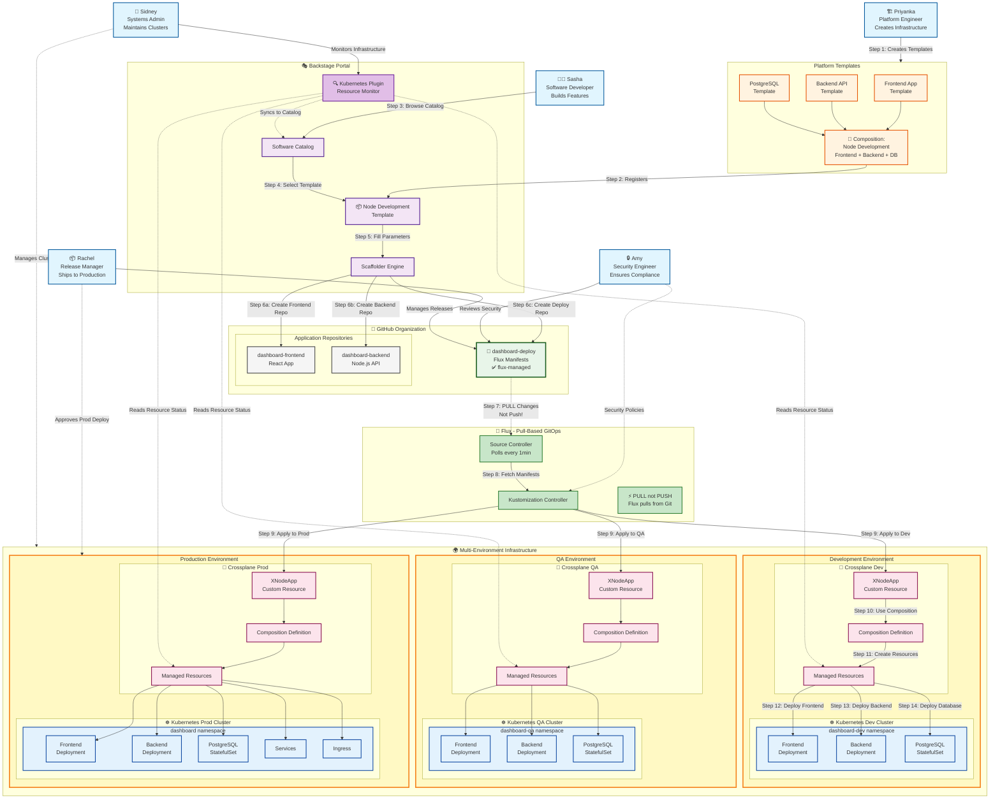

# GitOps Workflow: Pull-Based Deployment with Backstage, Flux, and Crossplane

## Overview

This document illustrates how developers use Backstage to create full-stack applications that are automatically deployed via Flux using a pull-based GitOps model.

## Architecture Diagram



## User Stories

> We use [GitLab's documented personas](https://handbook.gitlab.com/handbook/product/personas/) to represent typical users of our platform. These personas are based on extensive user research and help us design better experiences.

### 🏗️ Priyanka's Story: Building the Platform

**[Priyanka (Platform Engineer)](https://handbook.gitlab.com/handbook/product/personas/#priyanka-platform-engineer)** is responsible for building and maintaining the platform that development teams use. Priyanka creates reusable templates, manages Kubernetes clusters, and provides self-service infrastructure.

#### What Priyanka Creates:

1. **Individual Component Templates:**
   - **Frontend Template**: React app with TypeScript, routing, and state management
   - **Backend Template**: Node.js API with Express, authentication, and database connection
   - **PostgreSQL Template**: Database with persistent storage and backups

2. **Composition: Node Development**
   - Combines all three components into one deployable unit
   - Uses Crossplane Composition to define infrastructure
   - Creates Frontend Deployment, Backend Deployment, and PostgreSQL database
   - Example composition structure:
     ```yaml
     apiVersion: apiextensions.crossplane.io/v1
     kind: Composition
     metadata:
       name: node-development
     spec:
       compositeTypeRef:
         apiVersion: platform.io/v1
         kind: XNodeApp
       resources:
         - name: frontend
           base:
             apiVersion: apps/v1
             kind: Deployment
         - name: backend
           base:
             apiVersion: apps/v1
             kind: Deployment
         - name: database
           base:
             apiVersion: postgresql.cnpg.io/v1
             kind: Cluster
     ```

3. **Backstage Template Registration:**
   - Creates `template-node-development` repository
   - Backstage auto-discovers and adds to catalog
   - Developers can now self-serve complete stacks

### 👩‍💻 Sasha's Story: Creating a Dashboard

**[Sasha (Software Developer)](https://handbook.gitlab.com/handbook/product/personas/#sasha-software-developer)** is a software developer who wants to ship features as quickly and reliably as possible. Sasha needs to create a metrics dashboard for the team.

#### Sasha's Journey:

1. **Discovery**
   - Opens Backstage portal
   - Browses Software Catalog
   - Finds "Node Development" template

2. **Configuration**
   - Fills in the form:
     - Project name: `dashboard`
     - Team: `platform-team`
     - Database name: `metrics`
     - API port: `3001`
     - Enable monitoring: `true`

3. **Magic Happens** ✨
   - Backstage creates **THREE repositories**:
     - `dashboard-frontend` - React application code
     - `dashboard-backend` - Node.js API code  
     - `dashboard-deploy` - Deployment manifests (marked with `flux-managed`)

4. **Automatic Deployment**
   - Flux detects the new `dashboard-deploy` repository
   - Pulls the manifests (within 1 minute)
   - Applies Crossplane XR (XNodeApp)
   - Crossplane provisions all resources
   - Full stack is running in Kubernetes!

### 🔒 Amy's Story: Securing the Platform

**[Amy (Application Security Engineer)](https://handbook.gitlab.com/handbook/product/personas/#amy-application-security-engineer)** ensures that applications meet security standards and compliance requirements.

#### Amy's Security Workflow:

1. **Template Security Review**
   - Reviews Priyanka's templates for security best practices
   - Ensures secrets management is properly configured
   - Validates network policies and RBAC settings

2. **Deployment Manifest Scanning**
   - Automatically scans `dashboard-deploy` repository
   - Checks for exposed secrets or misconfigurations
   - Enforces security policies via OPA/Gatekeeper

3. **Runtime Security**
   - Monitors running workloads for vulnerabilities
   - Sets up security policies in Crossplane compositions
   - Ensures compliance with industry standards

### 📦 Rachel's Story: Managing Releases

**[Rachel (Release Manager)](https://handbook.gitlab.com/handbook/product/personas/#rachel-release-manager)** coordinates releases across environments and ensures smooth deployments.

#### Rachel's Release Process:

1. **Environment Promotion**
   - Reviews changes in Dev environment
   - Approves promotion to QA
   - Coordinates production releases

2. **GitOps Workflow**
   - Uses Git tags for release versions
   - Manages Kustomize overlays for each environment
   - Controls Flux sync policies

3. **Rollback Strategy**
   - Can quickly revert via Git
   - Flux automatically applies rollback
   - Zero-downtime deployments

### 🔧 Sidney's Story: Operating the Infrastructure

**[Sidney (Systems Administrator)](https://handbook.gitlab.com/handbook/product/personas/#sidney-systems-administrator)** maintains the Kubernetes clusters and ensures platform reliability.

#### Sidney's Operations:

1. **Cluster Management**
   - Monitors cluster health via Backstage Kubernetes Plugin
   - Manages node scaling and upgrades
   - Configures cluster-level resources

2. **Observability**
   - Sets up monitoring and alerting
   - Uses Backstage to visualize resource usage
   - Troubleshoots issues across environments

3. **Disaster Recovery**
   - Implements backup strategies
   - Tests failover procedures
   - Maintains runbooks in TechDocs

## Key Concepts

### Pull vs Push GitOps

| Aspect | Pull-Based (Flux) ✅ | Push-Based (CI/CD) ❌ |
|--------|---------------------|---------------------|
| **Direction** | Flux pulls from Git | CI pushes to cluster |
| **Security** | No external cluster access | Cluster credentials in CI |
| **Network** | Cluster never exposed | Requires ingress/API access |
| **Source of Truth** | Git only | Multiple sources |
| **Reconciliation** | Automatic | Manual triggers |

### Repository Structure

```
dashboard-frontend/          # Application code
├── .github/
│   └── workflows/
│       ├── ci.yaml        # Test & build
│       └── release.yaml   # Build & push image
├── src/
├── package.json
└── Dockerfile

dashboard-backend/           # Application code
├── .github/
│   └── workflows/
│       ├── ci.yaml        # Test & build
│       └── release.yaml   # Build & push image
├── src/
├── package.json
└── Dockerfile

dashboard-deploy/           # GitOps manifests
├── base/
│   ├── frontend-deployment.yaml
│   ├── backend-deployment.yaml
│   └── postgres-xr.yaml
├── overlays/
│   ├── dev/
│   └── prod/
└── kustomization.yaml
```

### Benefits

#### For Developers (Sasha)
- **One-click deployment** - Complete stack from a form
- **No YAML wrestling** - Templates handle complexity
- **Separation of concerns** - Code separate from deployment
- **Fast iteration** - Push code, Flux deploys automatically

#### For Platform Engineers (Simone)
- **Standardization** - All teams use same patterns
- **Reusability** - Write once, use many times
- **Governance** - Control via templates and compositions
- **Self-service** - Reduces support tickets

#### For Operations
- **GitOps** - Everything tracked in Git
- **Security** - No cluster credentials outside
- **Rollback** - Simple `git revert`
- **Observability** - Flux provides metrics and alerts

## How It Works

1. **Template Selection** → Developer picks template in Backstage
2. **Repository Creation** → Backstage creates app + deploy repos
3. **Code Development** → Developers work in app repos
4. **Manifest Management** → Deploy repo contains all K8s resources
5. **Flux Polling** → Flux continuously pulls from deploy repo
6. **Crossplane Magic** → Compositions create actual resources
7. **Kubernetes Reality** → Everything running in the cluster

## Summary

This architecture provides:
- **Pull-based security** - Cluster pulls, never exposed
- **Developer productivity** - Self-service everything
- **Platform scalability** - Templates reduce support burden
- **GitOps benefits** - Version control, audit, rollback
- **Multi-repo pattern** - Clean separation of code and config

## About the Personas

We use GitLab's well-researched personas to ensure our platform meets real user needs. Each persona represents real users based on extensive research:

### Core Personas in Our Workflow

#### [Sasha - Software Developer](https://handbook.gitlab.com/handbook/product/personas/#sasha-software-developer)
- **Goal**: Ship features quickly and reliably
- **Challenges**: Complex infrastructure, slow deployment processes
- **How we help**: Self-service templates, automated GitOps deployments

#### [Priyanka - Platform Engineer](https://handbook.gitlab.com/handbook/product/personas/#priyanka-platform-engineer)
- **Goal**: Build and maintain scalable platform infrastructure
- **Challenges**: Supporting diverse teams, ensuring consistency
- **How we help**: Crossplane compositions, Backstage templates

#### [Rachel - Release Manager](https://handbook.gitlab.com/handbook/product/personas/#rachel-release-manager)
- **Goal**: Coordinate smooth releases across environments
- **Challenges**: Managing dependencies, ensuring quality
- **How we help**: GitOps workflows, environment promotion

#### [Sidney - Systems Administrator](https://handbook.gitlab.com/handbook/product/personas/#sidney-systems-administrator)
- **Goal**: Maintain reliable infrastructure
- **Challenges**: Monitoring multiple clusters, incident response
- **How we help**: Backstage Kubernetes Plugin, centralized observability

#### [Amy - Application Security Engineer](https://handbook.gitlab.com/handbook/product/personas/#amy-application-security-engineer)
- **Goal**: Ensure applications meet security standards
- **Challenges**: Shift-left security, compliance requirements
- **How we help**: Security policies in templates, automated scanning

### Additional GitLab Personas

The complete [GitLab persona framework](https://handbook.gitlab.com/handbook/product/personas/) includes many other roles that interact with our platform:

- **[Parker - Product Manager](https://handbook.gitlab.com/handbook/product/personas/#parker-product-manager)**: Defines requirements and priorities
- **[Delaney - Development Team Lead](https://handbook.gitlab.com/handbook/product/personas/#delaney-development-team-lead)**: Manages development teams
- **[Presley - Product Designer](https://handbook.gitlab.com/handbook/product/personas/#presley-product-designer)**: Designs user experiences
- **[Allison - Application Ops](https://handbook.gitlab.com/handbook/product/personas/#allison-application-ops)**: Manages application operations
- **[Cameron - Compliance Manager](https://handbook.gitlab.com/handbook/product/personas/#cameron-compliance-manager)**: Ensures regulatory compliance

These personas help us build a platform that serves the entire organization's needs.