# GitOps Workflow: Pull-Based Deployment with Backstage, Flux, and Crossplane

## Overview

This document illustrates how developers use Backstage to create full-stack applications that are automatically deployed via Flux using a pull-based GitOps model.

## Architecture Diagram

```mermaid
graph TB
    %% Actors
    Emily["👩‍💻 Emily<br/>(Developer)"]
    Steve["👨‍💼 Steve<br/>(Platform Engineer)"]
    
    %% Backstage Layer
    subgraph Backstage["🎭 Backstage Portal"]
        Catalog["Software Catalog"]
        Scaffolder["Scaffolder Engine"]
        NodeTemplate["📦 Node Development<br/>Template"]
    end
    
    %% Steve's Templates
    subgraph Templates["Platform Templates"]
        FrontendTpl["Frontend App<br/>Template"]
        BackendTpl["Backend API<br/>Template"]
        PostgresTpl["PostgreSQL<br/>Template"]
        Composition["🎯 Composition:<br/>Node Development<br/>(Frontend + Backend + DB)"]
    end
    
    %% GitHub Repositories
    subgraph GitHub["📂 GitHub Organization"]
        subgraph AppRepos["Application Repositories"]
            FrontendRepo["dashboard-frontend<br/>(React App)"]
            BackendRepo["dashboard-backend<br/>(Node.js API)"]
        end
        
        DeployRepo["🚀 dashboard-deploy<br/>(Flux Manifests)<br/>✅ flux-managed"]
    end
    
    %% Flux GitOps
    subgraph FluxGitOps["🔄 Flux (Pull-Based GitOps)"]
        GitController["Source Controller<br/>Polls every 1min"]
        Kustomization["Kustomization Controller"]
        Note["⚡ PULL not PUSH<br/>Flux pulls from Git"]
    end
    
    %% Crossplane
    subgraph Crossplane["🎯 Crossplane"]
        XRD["XNodeApp<br/>(Custom Resource)"]
        CompDef["Composition Definition"]
        Resources["Managed Resources"]
    end
    
    %% Kubernetes
    subgraph Kubernetes["☸️ Kubernetes Cluster"]
        subgraph Namespace["dashboard namespace"]
            Frontend["Frontend<br/>Deployment"]
            Backend["Backend<br/>Deployment"]
            Postgres["PostgreSQL<br/>StatefulSet"]
            Service1["Frontend<br/>Service"]
            Service2["Backend<br/>Service"]
            Ingress["Ingress"]
        end
    end
    
    %% Steve's Flow (Platform Engineering)
    Steve -->|"1. Creates Templates"| Templates
    FrontendTpl --> Composition
    BackendTpl --> Composition
    PostgresTpl --> Composition
    Composition -->|"2. Registers"| NodeTemplate
    
    %% Emily's Flow (Developer Experience)
    Emily -->|"3. Browse Catalog"| Catalog
    Catalog -->|"4. Select Template"| NodeTemplate
    NodeTemplate -->|"5. Fill Parameters"| Scaffolder
    Scaffolder -->|"6a. Create Frontend Repo"| FrontendRepo
    Scaffolder -->|"6b. Create Backend Repo"| BackendRepo
    Scaffolder -->|"6c. Create Deploy Repo"| DeployRepo
    
    %% GitOps Pull Flow
    DeployRepo -.->|"7. PULL Changes<br/>(Not Push!)"| GitController
    GitController -->|"8. Fetch Manifests"| Kustomization
    Kustomization -->|"9. Apply XR"| XRD
    
    %% Crossplane Provisioning
    XRD -->|"10. Use Composition"| CompDef
    CompDef -->|"11. Create Resources"| Resources
    Resources -->|"12. Deploy Frontend"| Frontend
    Resources -->|"13. Deploy Backend"| Backend
    Resources -->|"14. Deploy Database"| Postgres
    Resources -->|"15. Create Services"| Service1
    Resources --> Service2
    Resources -->|"16. Configure Ingress"| Ingress
    
    %% Feedback Loop
    GitController -.->|"Status"| Note
    Resources -.->|"Ready Status"| DeployRepo
    
    %% Styling
    classDef actor fill:#e1f5fe,stroke:#01579b,stroke-width:2px
    classDef backstage fill:#f3e5f5,stroke:#4a148c,stroke-width:2px
    classDef template fill:#fff3e0,stroke:#e65100,stroke-width:2px
    classDef repo fill:#f5f5f5,stroke:#424242,stroke-width:2px
    classDef deploy fill:#e8f5e9,stroke:#1b5e20,stroke-width:3px
    classDef flux fill:#c8e6c9,stroke:#2e7d32,stroke-width:2px
    classDef crossplane fill:#fce4ec,stroke:#880e4f,stroke-width:2px
    classDef k8s fill:#e3f2fd,stroke:#0d47a1,stroke-width:2px
    
    class Emily,Steve actor
    class Catalog,Scaffolder,NodeTemplate backstage
    class FrontendTpl,BackendTpl,PostgresTpl,Composition template
    class FrontendRepo,BackendRepo repo
    class DeployRepo deploy
    class GitController,Kustomization,Note flux
    class XRD,CompDef,Resources crossplane
    class Frontend,Backend,Postgres,Service1,Service2,Ingress,Namespace k8s
```



## User Stories

### 🏗️ Steve's Story: Building the Platform

**Steve is a platform engineer** who creates reusable templates for development teams.

#### What Steve Creates:

1. **Individual Component Templates:**
   - **Frontend Template**: React app with TypeScript, routing, and state management
   - **Backend Template**: Node.js API with Express, authentication, and database connection
   - **PostgreSQL Template**: Database with persistent storage and backups

2. **Composition: Node Development**
   ```yaml
   # Combines all three components into one deployable unit
   apiVersion: apiextensions.crossplane.io/v1
   kind: Composition
   metadata:
     name: node-development
   spec:
     compositeTypeRef:
       apiVersion: platform.io/v1
       kind: XNodeApp
     resources:
       - name: frontend
         base:
           apiVersion: apps/v1
           kind: Deployment
       - name: backend
         base:
           apiVersion: apps/v1
           kind: Deployment
       - name: database
         base:
           apiVersion: postgresql.cnpg.io/v1
           kind: Cluster
   ```

3. **Backstage Template Registration:**
   - Creates `template-node-development` repository
   - Backstage auto-discovers and adds to catalog
   - Developers can now self-serve complete stacks

### 👩‍💻 Emily's Story: Creating a Dashboard

**Emily is a developer** who needs to create a metrics dashboard for her team.

#### Emily's Journey:

1. **Discovery**
   - Opens Backstage portal
   - Browses Software Catalog
   - Finds "Node Development" template

2. **Configuration**
   - Fills in the form:
     - Project name: `dashboard`
     - Team: `platform-team`
     - Database name: `metrics`
     - API port: `3001`
     - Enable monitoring: `true`

3. **Magic Happens** ✨
   - Backstage creates **THREE repositories**:
     - `dashboard-frontend` - React application code
     - `dashboard-backend` - Node.js API code  
     - `dashboard-deploy` - Deployment manifests (marked with `flux-managed`)

4. **Automatic Deployment**
   - Flux detects the new `dashboard-deploy` repository
   - Pulls the manifests (within 1 minute)
   - Applies Crossplane XR (XNodeApp)
   - Crossplane provisions all resources
   - Full stack is running in Kubernetes!

## Key Concepts

### Pull vs Push GitOps

| Aspect | Pull-Based (Flux) ✅ | Push-Based (CI/CD) ❌ |
|--------|---------------------|---------------------|
| **Direction** | Flux pulls from Git | CI pushes to cluster |
| **Security** | No external cluster access | Cluster credentials in CI |
| **Network** | Cluster never exposed | Requires ingress/API access |
| **Source of Truth** | Git only | Multiple sources |
| **Reconciliation** | Automatic | Manual triggers |

### Repository Structure

```
dashboard-frontend/          # Application code
├── src/
├── package.json
└── Dockerfile

dashboard-backend/           # Application code
├── src/
├── package.json
└── Dockerfile

dashboard-deploy/           # GitOps manifests
├── base/
│   ├── frontend-deployment.yaml
│   ├── backend-deployment.yaml
│   └── postgres-xr.yaml
├── overlays/
│   ├── dev/
│   └── prod/
└── kustomization.yaml
```

### Benefits

#### For Developers (Emily)
- **One-click deployment** - Complete stack from a form
- **No YAML wrestling** - Templates handle complexity
- **Separation of concerns** - Code separate from deployment
- **Fast iteration** - Push code, Flux deploys automatically

#### For Platform Engineers (Steve)
- **Standardization** - All teams use same patterns
- **Reusability** - Write once, use many times
- **Governance** - Control via templates and compositions
- **Self-service** - Reduces support tickets

#### For Operations
- **GitOps** - Everything tracked in Git
- **Security** - No cluster credentials outside
- **Rollback** - Simple `git revert`
- **Observability** - Flux provides metrics and alerts

## How It Works

1. **Template Selection** → Developer picks template in Backstage
2. **Repository Creation** → Backstage creates app + deploy repos
3. **Code Development** → Developers work in app repos
4. **Manifest Management** → Deploy repo contains all K8s resources
5. **Flux Polling** → Flux continuously pulls from deploy repo
6. **Crossplane Magic** → Compositions create actual resources
7. **Kubernetes Reality** → Everything running in the cluster

## Summary

This architecture provides:
- **Pull-based security** - Cluster pulls, never exposed
- **Developer productivity** - Self-service everything
- **Platform scalability** - Templates reduce support burden
- **GitOps benefits** - Version control, audit, rollback
- **Multi-repo pattern** - Clean separation of code and config