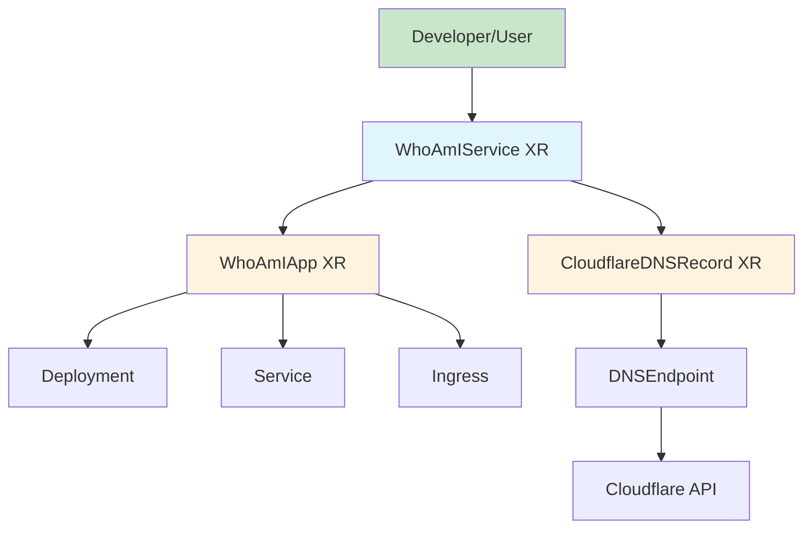

# Composition of Compositions: A Practical Tutorial

## Building Higher-Level Service Abstractions with Crossplane v2

This tutorial demonstrates how to create composite services using Crossplane's powerful "composition of compositions" pattern. We'll use the WhoAmIService template as a real-world example that combines an application deployment with DNS configuration into a single, easy-to-consume service.

## Table of Contents
1. [Introduction](#introduction)
2. [The Restaurant Analogy](#the-restaurant-analogy)
3. [Architecture Overview](#architecture-overview)
4. [Implementation Walkthrough](#implementation-walkthrough)
5. [Creating the Parent Composition](#creating-the-parent-composition)
6. [Handling Status Updates](#handling-status-updates)
7. [Common Pitfalls and Solutions](#common-pitfalls-and-solutions)
8. [Testing Your Composition](#testing-your-composition)
9. [Production Considerations](#production-considerations)

## Introduction

Composition of compositions is a design pattern where a Crossplane Composite Resource (XR) creates other XRs, rather than just managed resources. This enables:

- **Service Bundling**: Combine multiple infrastructure components into cohesive services
- **Abstraction Layers**: Hide complexity from end users while maintaining flexibility
- **Reusability**: Leverage existing compositions as building blocks
- **Separation of Concerns**: Different teams can manage different layers

### Why This Matters

Instead of requiring users to:
1. Deploy an application
2. Configure DNS separately
3. Set up monitoring
4. Configure backups

You can provide a single resource that handles everything:
```yaml
apiVersion: openportal.dev/v1alpha1
kind: WhoAmIService
metadata:
  name: my-app
  namespace: demo
spec:
  name: my-app  # That's all you need!
```

## The Restaurant Analogy

To understand composition of compositions, let's use our restaurant analogy:

### Traditional Approach (Direct Composition)
- **Customer** orders individual items: "I'll have a burger, fries, and a drink"
- **Kitchen** prepares each item separately
- **Result**: Customer manages multiple orders

### Composition of Compositions
- **Customer** orders a combo meal: "I'll have the Burger Combo #3"
- **Combo Menu** (Parent XR) defines: Burger + Fries + Drink
- **Individual Menus** (Child XRs) handle each component
- **Result**: Customer gets a complete meal with one order

In our WhoAmIService example:
- **WhoAmIService** = Combo Meal (Parent XR)
- **WhoAmIApp** = Burger (Child XR #1)
- **CloudflareDNSRecord** = Drink (Child XR #2)

## Architecture Overview



### Component Hierarchy

1. **WhoAmIService** (Parent XR)
   - Orchestrates the overall service
   - Manages relationships between components
   - Provides unified status reporting

2. **WhoAmIApp** (Child XR)
   - Handles application deployment
   - Creates Kubernetes resources (Deployment, Service, Ingress)
   - Reports application readiness

3. **CloudflareDNSRecord** (Child XR)
   - Manages DNS configuration
   - Creates DNSEndpoint for External-DNS
   - Handles DNS provider integration

## Implementation Walkthrough

### Step 1: Define the Parent XRD

First, create the XRD for your parent composition:

```yaml
# template-whoami-service/configuration/xrd.yaml
apiVersion: apiextensions.crossplane.io/v2
kind: CompositeResourceDefinition
metadata:
  name: whoamiservices.openportal.dev
spec:
  scope: Namespaced  # Crossplane v2 - XRs can be namespaced
  group: openportal.dev
  names:
    kind: WhoAmIService
    plural: whoamiservices
  defaultCompositionRef:
    name: whoamiservice  # Simple name, no domain suffix in v2
  versions:
  - name: v1alpha1
    served: true
    referenceable: true
    schema:
      openAPIV3Schema:
        type: object
        properties:
          spec:
            type: object
            properties:
              name:
                type: string
                description: "Service name (used for app and DNS)"
                pattern: "^[a-z0-9]([-a-z0-9]*[a-z0-9])?$"
                minLength: 1
                maxLength: 63
            required:
            - name
          status:
            type: object
            properties:
              appReady:
                type: boolean
              dnsReady:
                type: boolean
              domain:
                type: string
              ipAddress:
                type: string
```

### Step 2: Create the Parent Composition

The parent composition creates child XRs using go-templating:

```yaml
# template-whoami-service/configuration/composition.yaml
apiVersion: apiextensions.crossplane.io/v1
kind: Composition
metadata:
  name: whoamiservice
spec:
  compositeTypeRef:
    apiVersion: openportal.dev/v1alpha1
    kind: WhoAmIService
  
  mode: Pipeline
  pipeline:
  
  # Step 1: Load environment configuration
  - step: load-environment
    functionRef:
      name: function-environment-configs
    input:
      apiVersion: environmentconfigs.fn.crossplane.io/v1beta1
      kind: Input
      spec:
        environmentConfigs:
        - type: Reference
          ref:
            name: dns-config
  
  # Step 2: Create the WhoAmIApp XR
  - step: create-app
    functionRef:
      name: function-go-templating
    input:
      apiVersion: gotemplating.fn.crossplane.io/v1beta1
      kind: GoTemplate
      source: Inline
      inline:
        template: |
          {{- $name := .observed.composite.resource.spec.name }}
          {{- $xrName := .observed.composite.resource.metadata.name }}
          {{- $xrNamespace := .observed.composite.resource.metadata.namespace }}
          
          apiVersion: openportal.dev/v1alpha1
          kind: WhoAmIApp
          metadata:
            name: {{ $xrName }}-app
            namespace: {{ $xrNamespace }}
            annotations:
              # This annotation is REQUIRED for go-templating to track the resource
              gotemplating.fn.crossplane.io/composition-resource-name: whoami-app
              # Wait for this resource to be ready before proceeding
              gotemplating.fn.crossplane.io/ready: "True"
          spec:
            name: {{ $name }}
            replicas: 1  # Fixed value for simplicity
            image: "traefik/whoami:v1.10.1"  # Fixed demo image
```

## Creating the Parent Composition

### Key Concepts for Child XR Creation

When creating child XRs from a parent composition, remember these critical points:

#### 1. **No compositionRef in spec**
```yaml
# ❌ WRONG - Don't do this
spec:
  compositionRef:
    name: whoamiapp
  name: my-app

# ✅ CORRECT - Let XRD default handle it
spec:
  name: my-app
```

#### 2. **Required Annotations for go-templating**
```yaml
metadata:
  annotations:
    # This tells go-templating to track this resource
    gotemplating.fn.crossplane.io/composition-resource-name: unique-name
    # Optional: Wait for readiness
    gotemplating.fn.crossplane.io/ready: "True"
```

#### 3. **Namespace Handling in v2**
```yaml
# Always include namespace for namespaced XRs
metadata:
  name: {{ $xrName }}-app
  namespace: {{ $xrNamespace }}  # Critical in v2!
```

### Creating Multiple Child XRs

Here's how to create both application and DNS resources:

```yaml
# Step 3: Wait for app readiness
- step: wait-app-ready
  functionRef:
    name: function-auto-ready
    
# Step 4: Create DNS record with app information
- step: create-dns
  functionRef:
    name: function-go-templating
  input:
    apiVersion: gotemplating.fn.crossplane.io/v1beta1
    kind: GoTemplate
    source: Inline
    inline:
      template: |
        {{- $name := .observed.composite.resource.spec.name }}
        {{- $xrName := .observed.composite.resource.metadata.name }}
        {{- $xrNamespace := .observed.composite.resource.metadata.namespace }}
        
        # Extract IP from the app's ingress (if available)
        {{- $ingressIP := "" }}
        {{- range .observed.resources }}
          {{- if eq .resource.kind "Object" }}
            {{- if .resource.spec.forProvider.manifest }}
              {{- if eq .resource.spec.forProvider.manifest.kind "Ingress" }}
                {{- if .resource.status.atProvider.manifest.status.loadBalancer.ingress }}
                  {{- $ingressIP = (index .resource.status.atProvider.manifest.status.loadBalancer.ingress 0).ip | default "" }}
                {{- end }}
              {{- end }}
            {{- end }}
          {{- end }}
        {{- end }}
        
        # Default to placeholder if IP not yet available
        {{- if not $ingressIP }}
          {{- $ingressIP = "192.168.1.100" }}
        {{- end }}
        
        apiVersion: openportal.dev/v1alpha1
        kind: CloudflareDNSRecord
        metadata:
          name: {{ $xrName }}-dns
          namespace: {{ $xrNamespace }}
          annotations:
            gotemplating.fn.crossplane.io/composition-resource-name: cloudflare-dns
        spec:
          type: A
          name: {{ $name }}
          value: {{ $ingressIP | quote }}
          # Uses defaults: ttl: 1 (automatic), proxied: false, zone: "openportal-zone"
```

## Handling Status Updates

### The Correct Way to Update Composite Status

In Crossplane v2 with go-templating, update status by outputting the XR type with status fields:

```yaml
# Step 5: Update composite status
- step: update-status
  functionRef:
    name: function-go-templating
  input:
    apiVersion: gotemplating.fn.crossplane.io/v1beta1
    kind: GoTemplate
    source: Inline
    inline:
      template: |
        {{- $name := .observed.composite.resource.spec.name }}
        {{- $domain := printf "%s.%s" $name "example.com" }}
        
        # Extract readiness from child XRs
        {{- $appReady := false }}
        {{- $dnsReady := false }}
        
        {{- range .observed.resources }}
          {{- if eq .resource.kind "WhoAmIApp" }}
            {{- range .resource.status.conditions }}
              {{- if and (eq .type "Ready") (eq .status "True") }}
                {{- $appReady = true }}
              {{- end }}
            {{- end }}
          {{- end }}
          {{- if eq .resource.kind "CloudflareDNSRecord" }}
            {{- range .resource.status.conditions }}
              {{- if and (eq .type "Ready") (eq .status "True") }}
                {{- $dnsReady = true }}
              {{- end }}
            {{- end }}
          {{- end }}
        {{- end }}
        
        # Output the XR type with status (NOT CompositeResourceStatus!)
        apiVersion: openportal.dev/v1alpha1
        kind: WhoAmIService
        status:
          appReady: {{ $appReady }}
          dnsReady: {{ $dnsReady }}
          domain: {{ $domain | quote }}
```

### Common Status Update Mistakes

```yaml
# ❌ WRONG - CompositeResourceStatus doesn't exist
apiVersion: meta.crossplane.io/v1alpha1
kind: CompositeResourceStatus
status:
  ready: true

# ❌ WRONG - Missing required annotation
apiVersion: meta.crossplane.io/v1alpha1
kind: CompositeResourceStatus
metadata:
  annotations:
    gotemplating.fn.crossplane.io/composition-resource-name: status
status:
  ready: true

# ✅ CORRECT - Output the XR type directly
apiVersion: openportal.dev/v1alpha1
kind: WhoAmIService
status:
  ready: true
```

## Common Pitfalls and Solutions

### Pitfall 1: Wrong API Versions

**Problem**: Using incorrect API versions for XRs
```yaml
# Wrong
apiVersion: platform.io/v1alpha1  # Old or incorrect group
```

**Solution**: Use the correct group from your XRD
```yaml
# Correct
apiVersion: openportal.dev/v1alpha1
```

### Pitfall 2: Missing Namespace

**Problem**: Forgetting namespace for namespaced XRs
```yaml
# Wrong
metadata:
  name: my-resource
  # Missing namespace!
```

**Solution**: Always include namespace for v2 namespaced XRs
```yaml
# Correct
metadata:
  name: my-resource
  namespace: {{ $xrNamespace }}
```

### Pitfall 3: Incorrect Composition Names in XRDs

**Problem**: Using v1-style composition names with domain suffixes
```yaml
# Wrong (v1 style)
defaultCompositionRef:
  name: whoamiapp.openportal.dev
```

**Solution**: Use simple names in v2
```yaml
# Correct (v2 style)
defaultCompositionRef:
  name: whoamiapp
```

### Pitfall 4: Resource Tracking Issues

**Problem**: go-templating can't track resources without proper annotations
```yaml
# Missing required annotation
metadata:
  name: my-resource
```

**Solution**: Add composition-resource-name annotation
```yaml
metadata:
  name: my-resource
  annotations:
    gotemplating.fn.crossplane.io/composition-resource-name: unique-id
```

## Testing Your Composition

### 1. Deploy the Parent XRD and Composition

```bash
# Apply XRD
kubectl apply -f template-whoami-service/configuration/xrd.yaml

# Apply Composition
kubectl apply -f template-whoami-service/configuration/composition.yaml
```

### 2. Create a Test Instance

```yaml
# test-whoami-service.yaml
apiVersion: openportal.dev/v1alpha1
kind: WhoAmIService
metadata:
  name: test-app
  namespace: demo
spec:
  name: test-app
  replicas: 2
```

```bash
kubectl apply -f test-whoami-service.yaml
```

### 3. Verify Child XR Creation

```bash
# Check parent XR
kubectl get whoamiservices -n demo

# Check child XRs
kubectl get whoamiapps,cloudflarednsrecords -n demo

# Check actual resources
kubectl get pods,services,ingresses -n demo
```

### 4. Debug Issues

```bash
# Check parent XR status
kubectl describe whoamiservices test-app -n demo

# Check composition reconciliation
kubectl get compositions whoamiservice -o yaml | grep -A 20 "status:"

# Check function pipeline logs
kubectl logs -n crossplane-system deployment/crossplane -f | grep whoamiservice
```

## Production Considerations

### 1. Version Management

Use semantic versioning for your compositions:
```bash
# Tag releases properly
git tag -a v1.0.0 -m "Initial release"
git tag -a v1.1.0 -m "Add monitoring support"
git tag -a v1.1.1 -m "Fix DNS status update"
```

### 2. Composition Revisions

Control composition updates:
```yaml
spec:
  compositionUpdatePolicy: Manual  # Don't auto-update in production
  compositionRevisionRef:
    name: whoamiservice-v1-0-0
```

### 3. Resource Limits

Set appropriate limits for child XRs:
```yaml
spec:
  resourceLimits:
    cpu: "1000m"
    memory: "1Gi"
```

### 4. Monitoring and Observability

Add labels for tracking:
```yaml
metadata:
  labels:
    service-tier: frontend
    managed-by: platform-team
    cost-center: engineering
```

### 5. Rollback Strategy

Keep previous composition revisions:
```bash
# List composition revisions
kubectl get compositionrevisions | grep whoamiservice

# Rollback if needed
kubectl patch whoamiservices test-app -n demo --type=merge \
  -p '{"spec":{"compositionRevisionRef":{"name":"whoamiservice-previous"}}}'
```

## Advanced Patterns

### Pattern 1: Conditional Resource Creation

Create resources based on spec fields:
```yaml
template: |
  {{- if .observed.composite.resource.spec.enableMonitoring }}
  apiVersion: monitoring.io/v1
  kind: ServiceMonitor
  metadata:
    name: {{ $xrName }}-monitor
  spec:
    selector:
      app: {{ $name }}
  {{- end }}
```

### Pattern 2: Resource Ordering with Dependencies

Use `gotemplating.fn.crossplane.io/ready` to control ordering:
```yaml
# First XR - will be created and wait for ready
annotations:
  gotemplating.fn.crossplane.io/composition-resource-name: database
  gotemplating.fn.crossplane.io/ready: "True"

# Second XR - created after database is ready
annotations:
  gotemplating.fn.crossplane.io/composition-resource-name: application
```

### Pattern 3: Data Passing Between XRs

Extract data from one XR to use in another:
```yaml
# Extract from first XR
{{- $dbHost := "" }}
{{- range .observed.resources }}
  {{- if eq .resource.metadata.name "database" }}
    {{- $dbHost = .resource.status.endpoint }}
  {{- end }}
{{- end }}

# Use in second XR
spec:
  databaseHost: {{ $dbHost }}
```

## Troubleshooting Guide

### Issue: "Composition not found"
**Symptom**: `cannot fetch Composition: Composition.apiextensions.crossplane.io "xxx.domain.com" not found`

**Solution**: Check XRD defaultCompositionRef uses v2 naming (no domain suffix)

### Issue: "field not declared in schema"
**Symptom**: `.spec.compositionRef: field not declared in schema`

**Solution**: Remove compositionRef from child XR specs

### Issue: "cannot apply composed resource"
**Symptom**: Resources not being created or updated

**Solution**: Add required go-templating annotations

### Issue: Status not updating
**Symptom**: Parent XR status remains empty

**Solution**: Output XR type with status, not CompositeResourceStatus

## Summary

Composition of compositions enables powerful service abstractions in Crossplane v2. Key takeaways:

1. **Parent XRs create Child XRs** - Build hierarchical service definitions
2. **Use XRD defaults** - Don't specify compositionRef in child XR specs
3. **Include namespaces** - Critical for v2 namespaced resources
4. **Track resources properly** - Use go-templating annotations
5. **Update status correctly** - Output XR type with status fields

This pattern transforms infrastructure complexity into simple, consumable services that developers love!

## Next Steps

- Explore the [WhoAmIService source code](https://github.com/open-service-portal/template-whoami-service)
- Read about [Crossplane Composition Functions](https://docs.crossplane.io/latest/concepts/composition-functions/)
- Learn about [Environment Configurations](https://github.com/crossplane-contrib/function-environment-configs)
- Join the [Crossplane Slack](https://slack.crossplane.io/) community

---

*Last updated: September 2025 | Based on Crossplane v2.0 and the WhoAmIService v1.0.4 template*