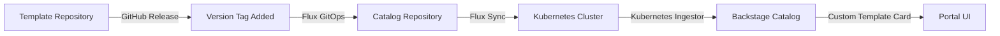

# Metadata and Tagging System

## Overview

This document describes the metadata and tagging system used throughout the Open Service Portal, including how templates are tagged, versioned, and how metadata flows from source repositories to the Backstage UI.

## Metadata Flow Architecture



### Detailed Flow

1. **Template Repository** → Creates and maintains template source
2. **GitHub Release** → Adds version label during release process
3. **Catalog Repository** → Aggregates template references
4. **Flux GitOps** → Syncs templates to Kubernetes cluster
5. **Kubernetes Ingestor** → Discovers and enriches template metadata
6. **Backstage Catalog** → Stores enriched entities
7. **Portal UI** → Displays templates with version labels

## Tagging System

### Source Tags

Templates are tagged with their source to identify where they originate from:

| Tag | Source | Added By | Purpose |
|-----|--------|----------|---------|
| `source:github-import` | GitHub repositories | Manual in template.yaml | Service templates imported from GitHub |
| `source:kubernetes` | Kubernetes cluster | Kubernetes Ingestor | Resources discovered from cluster |
| `source:crossplane` | Crossplane XRDs | Kubernetes Ingestor | Infrastructure templates from XRDs |

### Version Labels

Version information is stored in the `openportal.dev/version` label:

```yaml
metadata:
  labels:
    openportal.dev/version: "1.0.2"
```

## Implementation Details

### 1. Service Repository Templates

Service templates (e.g., `service-nodejs-template`) include source tags directly in their `template.yaml`:

```yaml
apiVersion: scaffolder.backstage.io/v1beta3
kind: Template
metadata:
  name: service-nodejs-template
  title: Node.js Service
  tags:
    - source:github-import  # Identifies GitHub as source
    - nodejs
    - javascript
```

**Location:** Added manually to each service template repository
**Purpose:** Identify templates imported from GitHub repositories

### 2. Crossplane XRD Templates

Infrastructure templates are automatically discovered and tagged by the Kubernetes Ingestor:

```typescript
// plugins/kubernetes-ingestor/src/provider/EntityProvider.ts
private generateTemplateFromXRD(xrd: V1CustomResourceDefinition): TemplateEntityV1beta3 {
  const template = {
    metadata: {
      name: templateName,
      labels: {
        'openportal.dev/version': version,  // Version from XRD
        'backstage.io/source-location': 'url:https://github.com/...'
      },
      tags: [
        'source:kubernetes',     // Added by ingestor
        'source:crossplane',     // Added by ingestor
        'infrastructure',
        'crossplane-xrd'
      ]
    }
  };
}
```

**Location:** Added automatically during ingestion
**Purpose:** Identify templates discovered from Kubernetes cluster

### 3. Version Label Generation

The `openportal.dev/version` label is generated during the GitHub release process:

#### Example: template-dns-record Release Workflow

```yaml
# .github/workflows/release.yaml
name: Release
on:
  release:
    types: [published]

jobs:
  update-catalog:
    steps:
      - name: Update template with version
        run: |
          VERSION="${{ github.event.release.tag_name }}"
          # Add version label to XRD
          yq eval '.metadata.labels["openportal.dev/version"] = "'$VERSION'"' -i xrd.yaml
          
      - name: Commit to catalog
        run: |
          # Commit versioned template to catalog repository
          git add .
          git commit -m "release: ${{ github.repository }} $VERSION"
          git push
```

**Implementation Status:**
- ✅ `template-dns-record` - First implementation (v1.0.2)
- 🔄 Other templates - Will follow same pattern

## Metadata Path: Template Repository to Portal UI

### Step 1: Template Repository
- Developer creates/updates template
- Template includes base metadata and tags

### Step 2: GitHub Release
- Release action triggered on new version
- Version label added: `openportal.dev/version: "x.y.z"`
- Template pushed to catalog repository

### Step 3: Catalog Repository
- Central registry for all templates
- Contains versioned template references
- Organized by type (service, infrastructure, etc.)

### Step 4: Flux GitOps
- Monitors catalog repository for changes
- Syncs templates to Kubernetes cluster
- Applies XRDs and other resources

### Step 5: Kubernetes Ingestor
- Discovers resources in cluster
- Adds source tags (`source:kubernetes`, `source:crossplane`)
- Enriches metadata with cluster information
- Publishes to Backstage catalog

### Step 6: Backstage Catalog
- Stores all template entities
- Maintains relationships and metadata
- Provides API for UI consumption

### Step 7: Portal UI
- Custom Template Card component
- Extracts version from `openportal.dev/version` label
- Displays as "TemplateName vX.Y.Z"

## Configuration Examples

### Service Template (GitHub Source)

```yaml
# service-nodejs-template/template.yaml
apiVersion: scaffolder.backstage.io/v1beta3
kind: Template
metadata:
  name: service-nodejs-template
  title: Node.js Service
  description: Create a Node.js microservice
  tags:
    - source:github-import
    - nodejs
    - recommended
spec:
  type: service
  # ... template specification
```

### Infrastructure Template (Kubernetes Source)

```yaml
# Generated by Kubernetes Ingestor from XRD
apiVersion: scaffolder.backstage.io/v1beta3
kind: Template
metadata:
  name: template-dns-record-v2
  title: DNSRecord
  labels:
    openportal.dev/version: "1.0.2"
    backstage.io/source-location: "url:https://github.com/open-service-portal/template-dns-record"
  tags:
    - source:kubernetes
    - source:crossplane
    - infrastructure
    - crossplane-xrd
spec:
  type: crossplane-xrd
  # ... generated from XRD specification
```

## Tag Usage in Backstage

### Filtering by Source

Users can filter templates in the `/create` page by source:
- `source:github-import` - Show GitHub templates
- `source:kubernetes` - Show cluster templates
- `source:crossplane` - Show infrastructure templates

### Version Display

The CustomTemplateCard component displays versions:
```typescript
const version = template.metadata.labels?.['openportal.dev/version'];
const displayTitle = version 
  ? `${template.metadata.title} v${version}`
  : template.metadata.title;
```

## Best Practices

### 1. Consistent Tagging
- Always include source tag in template.yaml
- Use standardized tag format: `source:<origin>`
- Keep tags lowercase with hyphens

### 2. Version Management
- Use semantic versioning (x.y.z)
- Generate versions during release process
- Store in `openportal.dev/version` label

### 3. Metadata Enrichment
- Let each system add its relevant metadata
- Don't duplicate information across systems
- Maintain clear ownership of metadata fields

### 4. Documentation
- Document custom labels and tags
- Explain metadata flow in README files
- Keep examples up to date

## Future Enhancements

### Planned Improvements

1. **Automated Version Bumping**
   - GitHub Actions to auto-increment versions
   - Changelog generation from commits
   - Version validation before release

2. **Extended Metadata**
   - `openportal.dev/stability`: alpha/beta/stable
   - `openportal.dev/deprecated`: Deprecation flag
   - `openportal.dev/successor`: Link to replacement

3. **Source Validation**
   - Verify source tags match actual origin
   - Automated tag correction
   - Source conflict detection

## Troubleshooting

### Missing Version Labels

If templates don't show versions:
1. Check if release workflow ran successfully
2. Verify label in XRD: `kubectl get xrd <name> -o yaml | grep version`
3. Force resync in Flux: `flux reconcile source git catalog`
4. Check ingestor logs: `kubectl logs -n backstage deployment/backstage`

### Incorrect Source Tags

If source tags are wrong:
1. Check template.yaml in repository
2. Verify ingestor configuration
3. Review EntityProvider.ts logic
4. Clear and re-import catalog

### Metadata Not Updating

If changes don't appear:
1. Check Flux sync status
2. Verify catalog webhook/polling
3. Review Backstage cache settings
4. Force catalog refresh in UI

## Summary

The metadata and tagging system provides a comprehensive way to track template sources, versions, and characteristics throughout their lifecycle. From initial creation in GitHub repositories, through release processes that add version labels, to discovery by the Kubernetes Ingestor, and finally display in the Backstage UI with custom template cards - each step adds valuable metadata that helps users understand and choose the right templates for their needs.

Key components:
- **Source Tags**: Identify where templates originate
- **Version Labels**: Track template versions through releases
- **Metadata Flow**: Clear path from repository to UI
- **Automatic Enrichment**: Systems add relevant metadata at each step

This system ensures templates are well-documented, versioned, and easily discoverable in the Open Service Portal.