# Open Service Portal Workflow Documentation

## Overview

The Open Service Portal orchestrates multiple workflows that enable teams to develop, release, and consume infrastructure and service templates. This document explains the complete platform workflow - from initial template development through automated release processes (including GitHub Actions) to GitOps deployment and resource provisioning via Backstage.

## High-Level Platform Workflow

The platform operates through three main workflow phases with PR reviews as critical checkpoints:

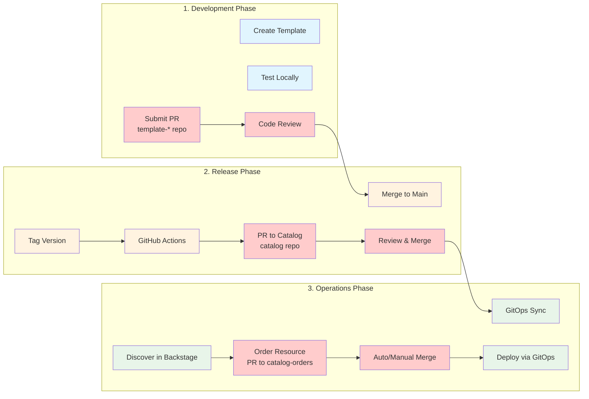
```mermaid
graph LR
    subgraph "1. Development Phase"
        D1[Create Template]
        D2[Test Locally]
        D3[Submit PR<br/>template-* repo]
        D4[Code Review]
    end
    
    subgraph "2. Release Phase"
        R1[Merge to Main]
        R2[Tag Version]
        R3[GitHub Actions]
        R4[PR to Catalog<br/>catalog repo]
        R5[Review & Merge]
    end
    
    subgraph "3. Operations Phase"
        O1[GitOps Sync]
        O2[Discover in Backstage]
        O3[Order Resource<br/>PR to catalog-orders]
        O4[Auto/Manual Merge]
        O5[Deploy via GitOps]
    end
    
    D3 --> D4
    D4 --> R1
    R2 --> R3
    R3 --> R4
    R4 --> R5
    R5 --> O1
    O2 --> O3
    O3 --> O4
    O4 --> O5
    
    style D3 fill:#ffcccc
    style D4 fill:#ffcccc
    style R4 fill:#ffcccc
    style R5 fill:#ffcccc
    style O3 fill:#ffcccc
    style O4 fill:#ffcccc
    style D1 fill:#e1f5fe
    style D2 fill:#e1f5fe
    style R1 fill:#fff3e0
    style R2 fill:#fff3e0
    style R3 fill:#fff3e0
    style O1 fill:#e8f5e9
    style O2 fill:#e8f5e9
    style O5 fill:#e8f5e9
```

## Architecture Components

### Repository Structure

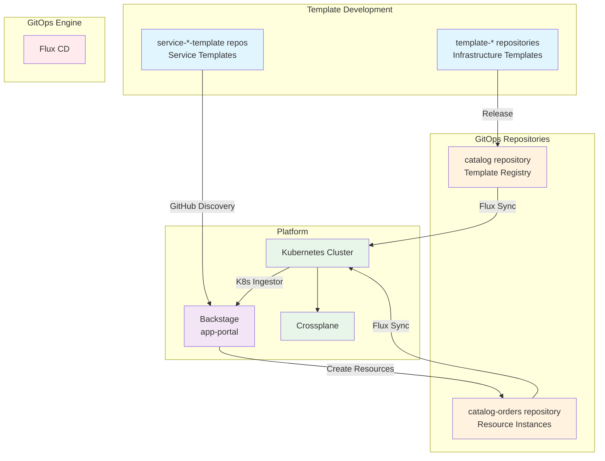
```mermaid
graph TB
    subgraph "Template Development"
        TR[template-* repositories<br/>Infrastructure Templates]
        SR[service-*-template repos<br/>Service Templates]
    end
    
    subgraph "GitOps Repositories"
        CAT[catalog repository<br/>Template Registry]
        ORD[catalog-orders repository<br/>Resource Instances]
    end
    
    subgraph "Platform"
        BS[Backstage<br/>app-portal]
        K8S[Kubernetes Cluster]
        XP[Crossplane]
    end
    
    subgraph "GitOps Engine"
        FLUX[Flux CD]
    end
    
    TR -->|Release| CAT
    SR -->|GitHub Discovery| BS
    CAT -->|Flux Sync| K8S
    K8S -->|K8s Ingestor| BS
    BS -->|Create Resources| ORD
    ORD -->|Flux Sync| K8S
    K8S --> XP
    
    style TR fill:#e1f5fe
    style SR fill:#e1f5fe
    style CAT fill:#fff3e0
    style ORD fill:#fff3e0
    style BS fill:#f3e5f5
    style K8S fill:#e8f5e9
    style XP fill:#e8f5e9
    style FLUX fill:#ffebee
```

## Pull Request Workflows

The platform uses pull requests at three critical points as quality gates, with different roles responsible for reviews:

### PR Review Points Summary

| Repository | PR Created By | Reviewed By | Purpose | Auto-merge |
|------------|---------------|-------------|---------|------------|
| `template-*` | Developers | Team members | Code review, testing | No |
| `catalog` | GitHub Actions | Platform Admin | Template governance | No |
| `catalog-orders` | Backstage Scaffolder | Bot/Platform Admin | Resource validation | Configurable |

### PR Checkpoints Overview

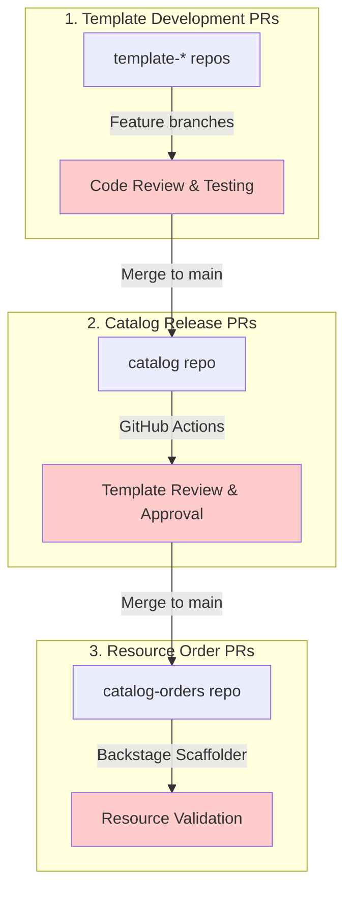
```mermaid
graph TB
    subgraph "1. Template Development PRs"
        TD[template-* repos]
        TDR[Code Review & Testing]
    end
    
    subgraph "2. Catalog Release PRs"
        CR[catalog repo]
        CRR[Template Review & Approval]
    end
    
    subgraph "3. Resource Order PRs"
        CO[catalog-orders repo]
        COR[Resource Validation]
    end
    
    TD -->|Feature branches| TDR
    TDR -->|Merge to main| CR
    CR -->|GitHub Actions| CRR
    CRR -->|Merge to main| CO
    CO -->|Backstage Scaffolder| COR
    
    style TDR fill:#ffcccc
    style CRR fill:#ffcccc
    style COR fill:#ffcccc
```

### 1. Template Development PRs (template-* repositories)

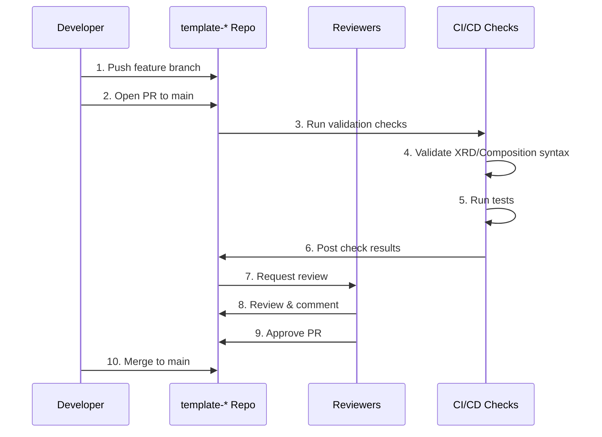
```mermaid
sequenceDiagram
    participant Dev as Developer
    participant Repo as template-* Repo
    participant Rev as Reviewers
    participant CI as CI/CD Checks
    
    Dev->>Repo: 1. Push feature branch
    Dev->>Repo: 2. Open PR to main
    Repo->>CI: 3. Run validation checks
    CI->>CI: 4. Validate XRD/Composition syntax
    CI->>CI: 5. Run tests
    CI->>Repo: 6. Post check results
    Repo->>Rev: 7. Request review
    Rev->>Repo: 8. Review & comment
    Rev->>Repo: 9. Approve PR
    Dev->>Repo: 10. Merge to main
```

### 2. Catalog Release PRs (catalog repository)

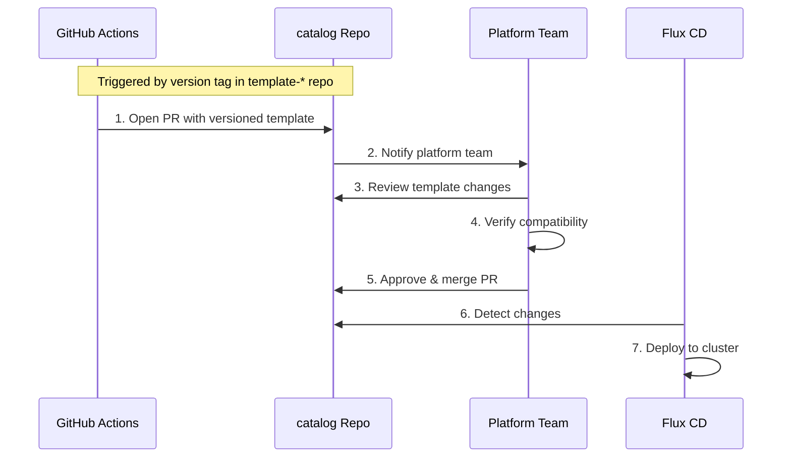
```mermaid
sequenceDiagram
    participant GA as GitHub Actions
    participant Cat as catalog Repo
    participant Team as Platform Team
    participant Flux as Flux CD
    
    Note over GA,Cat: Triggered by version tag in template-* repo
    GA->>Cat: 1. Open PR with versioned template
    Cat->>Team: 2. Notify platform team
    Team->>Cat: 3. Review template changes
    Team->>Team: 4. Verify compatibility
    Team->>Cat: 5. Approve & merge PR
    Flux->>Cat: 6. Detect changes
    Flux->>Flux: 7. Deploy to cluster
```

### 3. Resource Order PRs (catalog-orders repository)

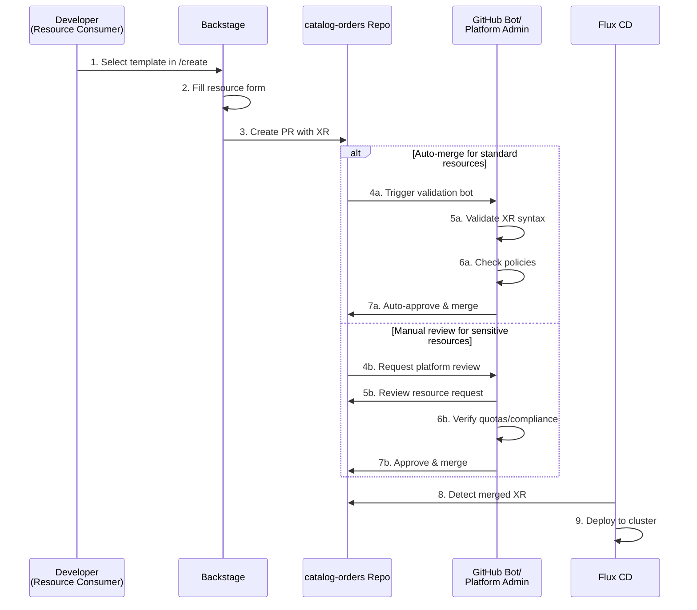
```mermaid
sequenceDiagram
    participant Dev as Developer<br/>(Resource Consumer)
    participant BS as Backstage
    participant Orders as catalog-orders Repo
    participant Bot as GitHub Bot/<br/>Platform Admin
    participant Flux as Flux CD
    
    Dev->>BS: 1. Select template in /create
    BS->>BS: 2. Fill resource form
    BS->>Orders: 3. Create PR with XR
    
    alt Auto-merge for standard resources
        Orders->>Bot: 4a. Trigger validation bot
        Bot->>Bot: 5a. Validate XR syntax
        Bot->>Bot: 6a. Check policies
        Bot->>Orders: 7a. Auto-approve & merge
    else Manual review for sensitive resources
        Orders->>Bot: 4b. Request platform review
        Bot->>Orders: 5b. Review resource request
        Bot->>Bot: 6b. Verify quotas/compliance
        Bot->>Orders: 7b. Approve & merge
    end
    
    Flux->>Orders: 8. Detect merged XR
    Flux->>Flux: 9. Deploy to cluster
```

## Release Workflows

### GitHub Actions Automation

GitHub Actions serves as the automation engine for the release process, connecting template developers with platform administrators:

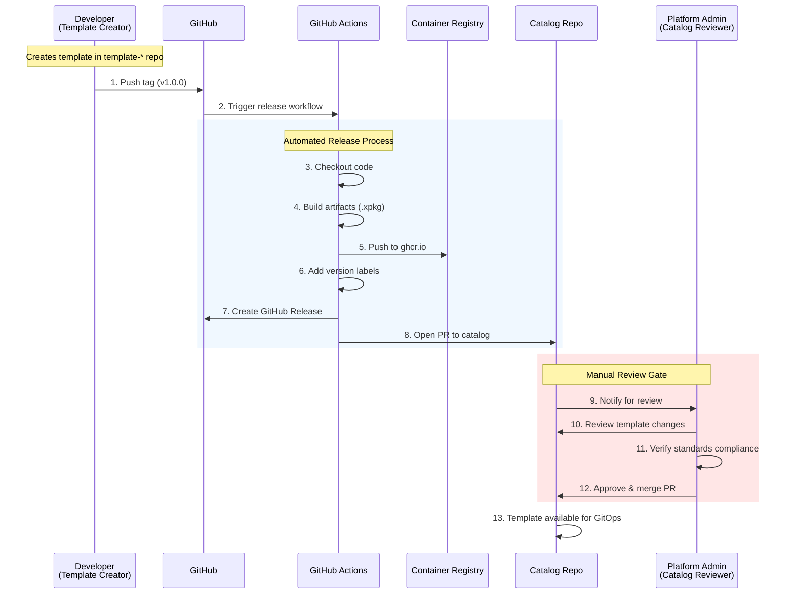
```mermaid
sequenceDiagram
    participant Dev as Developer<br/>(Template Creator)
    participant GH as GitHub
    participant GA as GitHub Actions
    participant Reg as Container Registry
    participant Cat as Catalog Repo
    participant Admin as Platform Admin<br/>(Catalog Reviewer)
    
    Note over Dev: Creates template in template-* repo
    Dev->>GH: 1. Push tag (v1.0.0)
    GH->>GA: 2. Trigger release workflow
    
    rect rgb(240, 248, 255)
        Note over GA: Automated Release Process
        GA->>GA: 3. Checkout code
        GA->>GA: 4. Build artifacts (.xpkg)
        GA->>Reg: 5. Push to ghcr.io
        GA->>GA: 6. Add version labels
        GA->>GH: 7. Create GitHub Release
        GA->>Cat: 8. Open PR to catalog
    end
    
    rect rgb(255, 230, 230)
        Note over Admin,Cat: Manual Review Gate
        Cat->>Admin: 9. Notify for review
        Admin->>Cat: 10. Review template changes
        Admin->>Admin: 11. Verify standards compliance
        Admin->>Cat: 12. Approve & merge PR
    end
    
    Cat->>Cat: 13. Template available for GitOps
```

The GitHub Actions workflow (`/.github/workflows/release.yaml`) handles:
- Building Crossplane configuration packages
- Publishing container images
- Versioning templates
- Creating GitHub releases
- **Opening PR to catalog repository** (requires review)

### Catalog PR Review Process

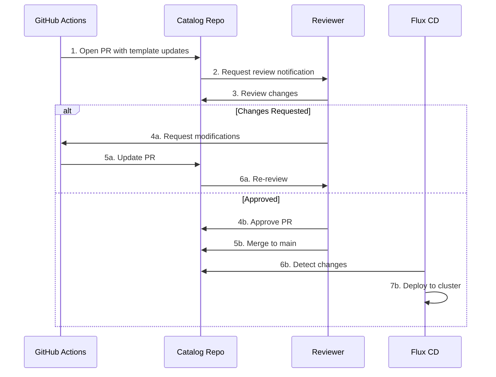
```mermaid
sequenceDiagram
    participant GA as GitHub Actions
    participant Cat as Catalog Repo
    participant Rev as Reviewer
    participant Flux as Flux CD
    
    GA->>Cat: 1. Open PR with template updates
    Cat->>Rev: 2. Request review notification
    Rev->>Cat: 3. Review changes
    
    alt Changes Requested
        Rev->>GA: 4a. Request modifications
        GA->>Cat: 5a. Update PR
        Cat->>Rev: 6a. Re-review
    else Approved
        Rev->>Cat: 4b. Approve PR
        Rev->>Cat: 5b. Merge to main
        Flux->>Cat: 6b. Detect changes
        Flux->>Flux: 7b. Deploy to cluster
    end
```

## GitOps Deployment Workflows

### 1. Template Release Flow

This flow shows how infrastructure templates are developed, released, and made available in the cluster.

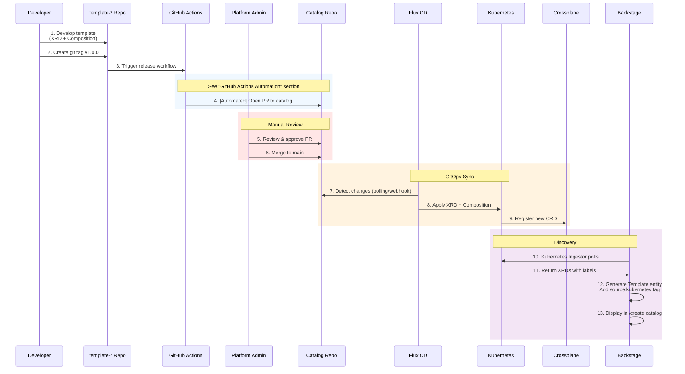
```mermaid
sequenceDiagram
    participant Dev as Developer
    participant Repo as template-* Repo
    participant GHA as GitHub Actions
    participant Admin as Platform Admin
    participant Cat as Catalog Repo
    participant Flux as Flux CD
    participant K8s as Kubernetes
    participant Cross as Crossplane
    participant Back as Backstage

    Dev->>Repo: 1. Develop template<br/>(XRD + Composition)
    Dev->>Repo: 2. Create git tag v1.0.0
    Repo->>GHA: 3. Trigger release workflow
    
    rect rgb(240, 248, 255)
        Note over GHA,Cat: See "GitHub Actions Automation" section
        GHA->>Cat: 4. [Automated] Open PR to catalog
    end
    
    rect rgb(255, 230, 230)
        Note over Admin,Cat: Manual Review
        Admin->>Cat: 5. Review & approve PR
        Admin->>Cat: 6. Merge to main
    end
    
    rect rgb(255, 243, 224)
        Note over Flux,K8s: GitOps Sync
        Flux->>Cat: 7. Detect changes (polling/webhook)
        Flux->>K8s: 8. Apply XRD + Composition
        K8s->>Cross: 9. Register new CRD
    end
    
    rect rgb(243, 229, 245)
        Note over K8s,Back: Discovery
        Back->>K8s: 10. Kubernetes Ingestor polls
        K8s-->>Back: 11. Return XRDs with labels
        Back->>Back: 12. Generate Template entity<br/>Add source:kubernetes tag
        Back->>Back: 13. Display in /create catalog
    end
```

### 2. Resource Ordering Flow

This flow shows how developers use Backstage to create infrastructure resources that are deployed via GitOps.

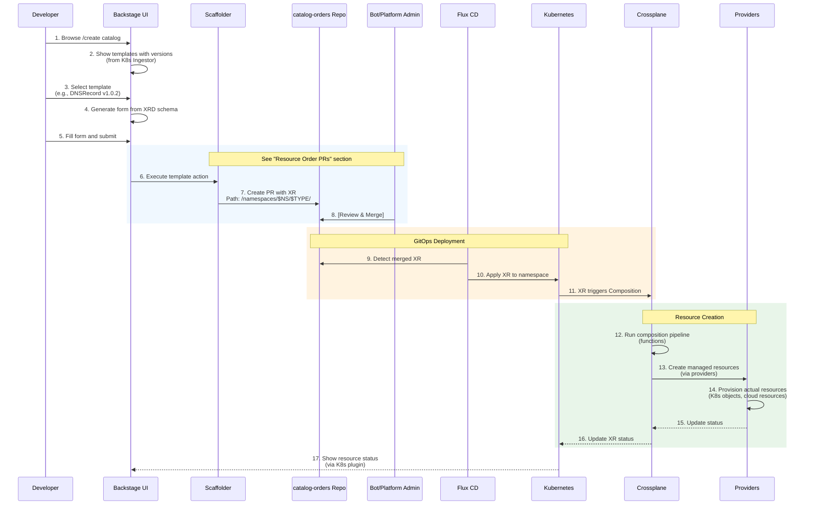
```mermaid
sequenceDiagram
    participant User as Developer
    participant UI as Backstage UI
    participant Scaff as Scaffolder
    participant Orders as catalog-orders Repo
    participant Rev as Bot/Platform Admin
    participant Flux as Flux CD
    participant K8s as Kubernetes
    participant Cross as Crossplane
    participant Prov as Providers

    User->>UI: 1. Browse /create catalog
    UI->>UI: 2. Show templates with versions<br/>(from K8s Ingestor)
    User->>UI: 3. Select template<br/>(e.g., DNSRecord v1.0.2)
    UI->>UI: 4. Generate form from XRD schema
    User->>UI: 5. Fill form and submit
    
    rect rgb(240, 248, 255)
        Note over Scaff,Rev: See "Resource Order PRs" section
        UI->>Scaff: 6. Execute template action
        Scaff->>Orders: 7. Create PR with XR<br/>Path: /namespaces/$NS/$TYPE/
        Rev->>Orders: 8. [Review & Merge]
    end
    
    rect rgb(255, 243, 224)
        Note over Orders,K8s: GitOps Deployment
        Flux->>Orders: 9. Detect merged XR
        Flux->>K8s: 10. Apply XR to namespace
        K8s->>Cross: 11. XR triggers Composition
    end
    
    rect rgb(232, 245, 233)
        Note over Cross,Prov: Resource Creation
        Cross->>Cross: 12. Run composition pipeline<br/>(functions)
        Cross->>Prov: 13. Create managed resources<br/>(via providers)
        Prov->>Prov: 14. Provision actual resources<br/>(K8s objects, cloud resources)
        Prov-->>Cross: 15. Update status
        Cross-->>K8s: 16. Update XR status
    end
    
    K8s-->>UI: 17. Show resource status<br/>(via K8s plugin)
```

### 3. Multi-Repository Pattern

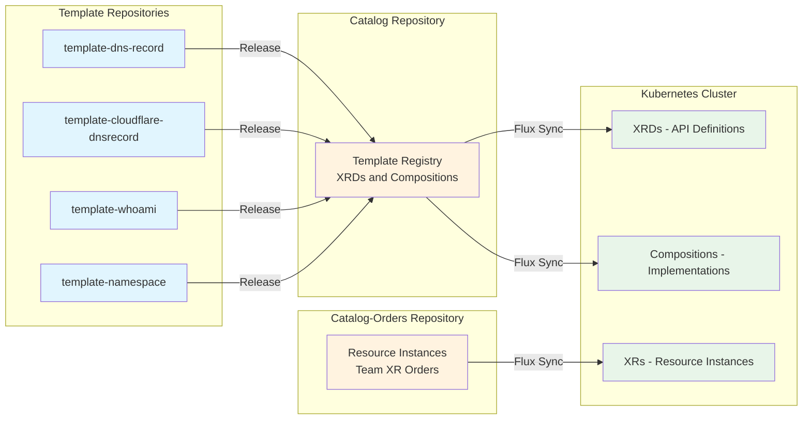
```mermaid
graph LR
    subgraph "Template Repositories"
        T1[template-dns-record]
        T2[template-cloudflare-dnsrecord]
        T3[template-whoami]
        T4[template-namespace]
    end
    
    subgraph "Catalog Repository"
        C1[Template Registry<br/>XRDs and Compositions]
    end
    
    subgraph "Catalog-Orders Repository"
        O1[Resource Instances<br/>Team XR Orders]
    end
    
    subgraph "Kubernetes Cluster"
        K1[XRDs - API Definitions]
        K2[Compositions - Implementations]
        K3[XRs - Resource Instances]
    end
    
    T1 -->|Release| C1
    T2 -->|Release| C1
    T3 -->|Release| C1
    T4 -->|Release| C1
    
    C1 -->|Flux Sync| K1
    C1 -->|Flux Sync| K2
    O1 -->|Flux Sync| K3
    
    style T1 fill:#e1f5fe
    style T2 fill:#e1f5fe
    style T3 fill:#e1f5fe
    style T4 fill:#e1f5fe
    style C1 fill:#fff3e0
    style O1 fill:#fff3e0
    style K1 fill:#e8f5e9
    style K2 fill:#e8f5e9
    style K3 fill:#e8f5e9
```

#### Repository Structure Details

**Catalog Repository** (`catalog/`)
```
templates/
├── dns-record/
│   ├── xrd.yaml
│   └── composition.yaml
├── cloudflare-dnsrecord/
│   ├── xrd.yaml
│   └── composition.yaml
└── ...
```

**Catalog-Orders Repository** (`catalog-orders/`)
```
namespaces/
├── team-alpha/
│   ├── dns-records/
│   │   ├── api-dns.yaml
│   │   └── web-dns.yaml
│   └── applications/
│       └── frontend.yaml
├── team-beta/
│   └── dns-records/
│       └── backend-dns.yaml
└── ...
```

## Detailed Component Interactions

### Backstage Integration Points

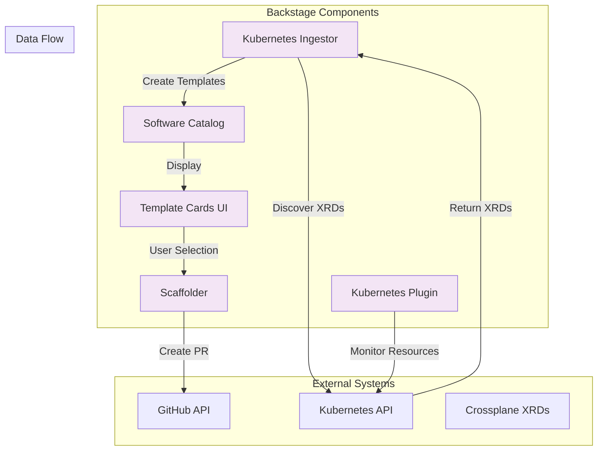
```mermaid
graph TB
    subgraph "Backstage Components"
        SC[Software Catalog]
        SF[Scaffolder]
        KI[Kubernetes Ingestor]
        KP[Kubernetes Plugin]
        TC[Template Cards UI]
    end
    
    subgraph "External Systems"
        GH[GitHub API]
        K8S[Kubernetes API]
        XRD[Crossplane XRDs]
    end
    
    subgraph "Data Flow"
        KI -->|Discover XRDs| K8S
        K8S -->|Return XRDs| KI
        KI -->|Create Templates| SC
        SC -->|Display| TC
        TC -->|User Selection| SF
        SF -->|Create PR| GH
        KP -->|Monitor Resources| K8S
    end
    
    style SC fill:#f3e5f5
    style SF fill:#f3e5f5
    style KI fill:#f3e5f5
    style KP fill:#f3e5f5
    style TC fill:#f3e5f5
```

### Flux GitOps Watchers

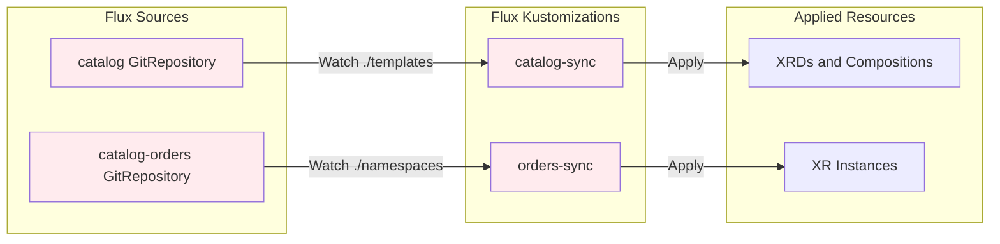
```mermaid
graph LR
    subgraph "Flux Sources"
        S1[catalog GitRepository]
        S2[catalog-orders GitRepository]
    end
    
    subgraph "Flux Kustomizations"
        K1[catalog-sync]
        K2[orders-sync]
    end
    
    subgraph "Applied Resources"
        R1[XRDs and Compositions]
        R2[XR Instances]
    end
    
    S1 -->|Watch ./templates| K1
    S2 -->|Watch ./namespaces| K2
    K1 -->|Apply| R1
    K2 -->|Apply| R2
    
    style S1 fill:#ffebee
    style S2 fill:#ffebee
    style K1 fill:#ffebee
    style K2 fill:#ffebee
```

## End-to-End Workflow Examples

### Example 1: Creating a DNS Record

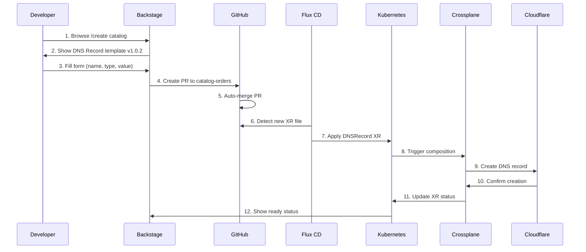
```mermaid
sequenceDiagram
    participant Dev as Developer
    participant BS as Backstage
    participant GH as GitHub
    participant Flux as Flux CD
    participant K8s as Kubernetes
    participant CP as Crossplane
    participant CF as Cloudflare
    
    Dev->>BS: 1. Browse /create catalog
    BS->>Dev: 2. Show DNS Record template v1.0.2
    Dev->>BS: 3. Fill form (name, type, value)
    BS->>GH: 4. Create PR to catalog-orders
    GH->>GH: 5. Auto-merge PR
    Flux->>GH: 6. Detect new XR file
    Flux->>K8s: 7. Apply DNSRecord XR
    K8s->>CP: 8. Trigger composition
    CP->>CF: 9. Create DNS record
    CF->>CP: 10. Confirm creation
    CP->>K8s: 11. Update XR status
    K8s->>BS: 12. Show ready status
```

### Example 2: Deploying an Application

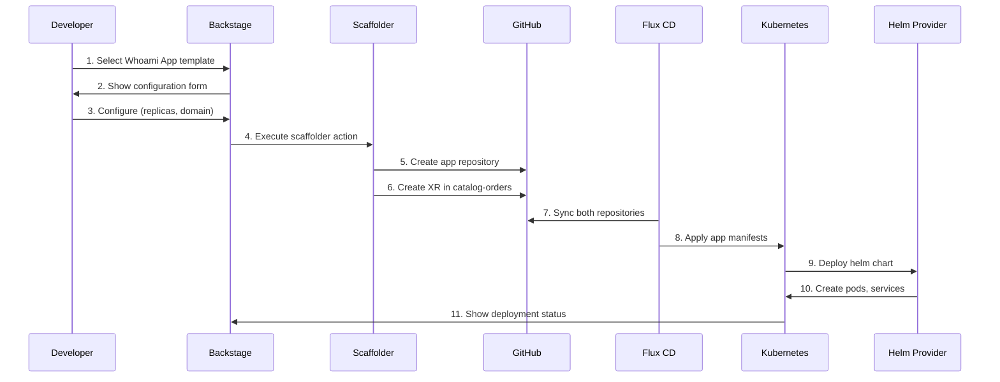
```mermaid
sequenceDiagram
    participant Dev as Developer
    participant BS as Backstage
    participant Scaff as Scaffolder
    participant GH as GitHub
    participant Flux as Flux CD
    participant K8s as Kubernetes
    participant Helm as Helm Provider
    
    Dev->>BS: 1. Select Whoami App template
    BS->>Dev: 2. Show configuration form
    Dev->>BS: 3. Configure (replicas, domain)
    BS->>Scaff: 4. Execute scaffolder action
    Scaff->>GH: 5. Create app repository
    Scaff->>GH: 6. Create XR in catalog-orders
    Flux->>GH: 7. Sync both repositories
    Flux->>K8s: 8. Apply app manifests
    K8s->>Helm: 9. Deploy helm chart
    Helm->>K8s: 10. Create pods, services
    K8s->>BS: 11. Show deployment status
```


## Versioning Strategy

### Template Versioning Flow

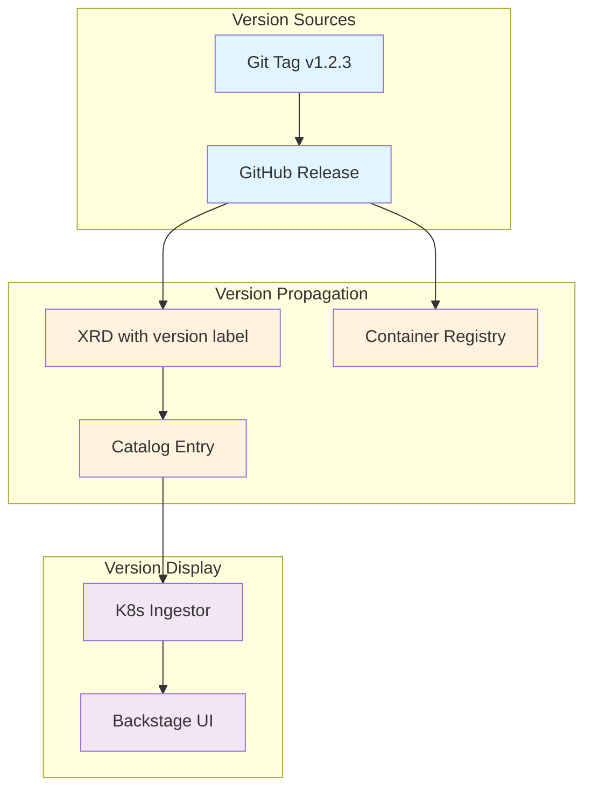
```mermaid
graph TB
    subgraph "Version Sources"
        GT[Git Tag v1.2.3]
        GR[GitHub Release]
    end
    
    subgraph "Version Propagation"
        XRD[XRD with version label]
        PKG[Container Registry]
        CAT[Catalog Entry]
    end
    
    subgraph "Version Display"
        ING[K8s Ingestor]
        UI[Backstage UI]
    end
    
    GT --> GR
    GR --> XRD
    GR --> PKG
    XRD --> CAT
    CAT --> ING
    ING --> UI
    
    style GT fill:#e1f5fe
    style GR fill:#e1f5fe
    style XRD fill:#fff3e0
    style PKG fill:#fff3e0
    style CAT fill:#fff3e0
    style ING fill:#f3e5f5
    style UI fill:#f3e5f5
```

Version flow:
1. Developer creates git tag (e.g., `v1.2.3`)
2. GitHub Actions builds and releases
3. Version added to XRD label: `openportal.dev/version: "1.2.3"`
4. Package pushed to `ghcr.io/template:v1.2.3`
5. Backstage displays as "Template v1.2.3"

## Namespace Organization

### catalog-orders Repository Structure

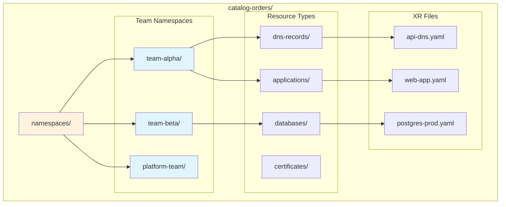
```mermaid
graph TB
    subgraph "catalog-orders/"
        ROOT[namespaces/]
        
        subgraph "Team Namespaces"
            NS1[team-alpha/]
            NS2[team-beta/]
            NS3[platform-team/]
        end
        
        subgraph "Resource Types"
            RT1[dns-records/]
            RT2[applications/]
            RT3[databases/]
            RT4[certificates/]
        end
        
        subgraph "XR Files"
            XR1[api-dns.yaml]
            XR2[web-app.yaml]
            XR3[postgres-prod.yaml]
        end
    end
    
    ROOT --> NS1
    ROOT --> NS2
    ROOT --> NS3
    NS1 --> RT1
    NS1 --> RT2
    RT1 --> XR1
    RT2 --> XR2
    NS2 --> RT3
    RT3 --> XR3
    
    style ROOT fill:#fff3e0
    style NS1 fill:#e1f5fe
    style NS2 fill:#e1f5fe
    style NS3 fill:#e1f5fe
```

## Crossplane v2 Architecture

### Namespaced XR Flow (No Claims)

```mermaid
graph LR
    subgraph "Developer Experience"
        DEV[Developer]
        XR[XR<br/>(Direct Resource)]
    end
    
    subgraph "Crossplane Processing"
        COMP[Composition]
        FUNC[Pipeline Functions]
        MR[Managed Resources]
    end
    
    subgraph "Infrastructure"
        PROV[Providers]
        RES[Actual Resources]
    end
    
    DEV -->|Creates| XR
    XR -->|Triggers| COMP
    COMP -->|Runs| FUNC
    FUNC -->|Generates| MR
    MR -->|Instructs| PROV
    PROV -->|Creates| RES
    
    style XR fill:#e8f5e9
    style COMP fill:#e8f5e9
    style FUNC fill:#e8f5e9
    
    Note1[No Claim needed!<br/>Direct XR in namespace]
    Note1 -.-> XR
    
    style Note1 fill:#ffffcc
```

## Error Handling and Recovery

### GitOps Error Recovery Flow

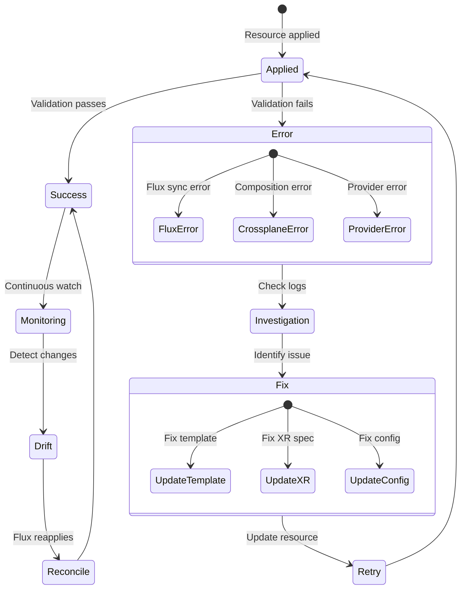
```mermaid
stateDiagram-v2
    [*] --> Applied: Resource applied
    Applied --> Error: Validation fails
    Applied --> Success: Validation passes
    
    Error --> Investigation: Check logs
    Investigation --> Fix: Identify issue
    Fix --> Retry: Update resource
    Retry --> Applied
    
    Success --> Monitoring: Continuous watch
    Monitoring --> Drift: Detect changes
    Drift --> Reconcile: Flux reapplies
    Reconcile --> Success
    
    state Error {
        [*] --> FluxError: Flux sync error
        [*] --> CrossplaneError: Composition error
        [*] --> ProviderError: Provider error
    }
    
    state Fix {
        [*] --> UpdateTemplate: Fix template
        [*] --> UpdateXR: Fix XR spec
        [*] --> UpdateConfig: Fix config
    }
```

## Monitoring and Observability

### Status Flow

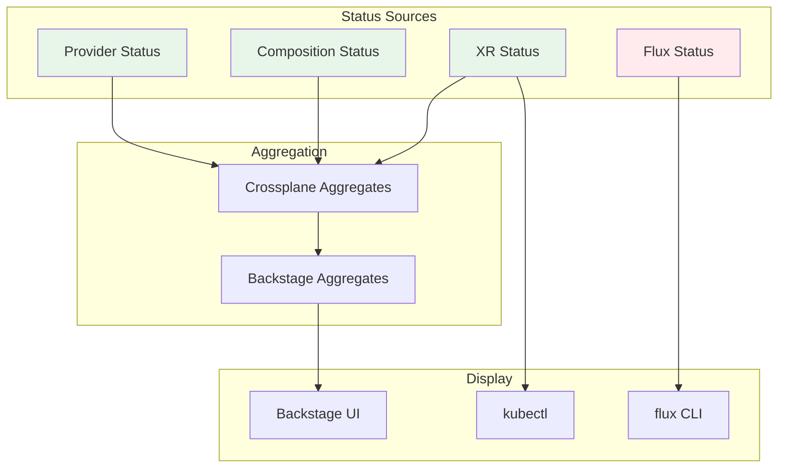
```mermaid
graph TB
    subgraph "Status Sources"
        PS[Provider Status]
        CS[Composition Status]
        XS[XR Status]
        FS[Flux Status]
    end
    
    subgraph "Aggregation"
        CA[Crossplane Aggregates]
        BA[Backstage Aggregates]
    end
    
    subgraph "Display"
        UI[Backstage UI]
        KC[kubectl]
        FX[flux CLI]
    end
    
    PS --> CA
    CS --> CA
    XS --> CA
    CA --> BA
    BA --> UI
    XS --> KC
    FS --> FX
    
    style PS fill:#e8f5e9
    style CS fill:#e8f5e9
    style XS fill:#e8f5e9
    style FS fill:#ffebee
```

## Best Practices

### 1. Template Development
- Always use Crossplane v2 with namespaced XRs
- Include comprehensive examples
- Add proper RBAC permissions
- Use semantic versioning

### 2. GitOps Repository Management
- Keep catalog organized by template type
- Use clear directory structure in catalog-orders
- Enable branch protection on main
- Set up automated PR validation

### 3. Backstage Integration
- Ensure XRDs have required labels
- Keep Kubernetes Ingestor polling interval reasonable
- Cache template data appropriately
- Provide clear template descriptions

### 4. Production Considerations
- Pin provider versions in production
- Implement proper RBAC for namespaces
- Set up monitoring and alerting
- Plan for disaster recovery


## Summary

The Open Service Portal workflow orchestrates multiple processes to deliver a complete platform experience:

### 1. **Development Workflows**
   - Local development with immediate feedback
   - Template creation following standards
   - PR-based collaboration and review
   - Testing before release

### 2. **Release Automation**
   - GitHub Actions automate the release pipeline
   - Semantic versioning throughout
   - Automatic catalog updates
   - Container registry publishing

### 3. **GitOps Deployment**
   - Flux ensures desired state
   - Two-repository pattern (catalog + orders)
   - Continuous reconciliation
   - Drift detection and correction

### 4. **Platform Integration**
   - Backstage provides the developer portal
   - Kubernetes hosts all resources
   - Crossplane manages infrastructure
   - Everything connected via APIs

### Key Benefits

1. **Developer Experience**
   - Self-service infrastructure provisioning
   - Visual forms generated from templates
   - Real-time status monitoring
   - No direct kubectl needed

2. **Operational Excellence**
   - Every change tracked in Git
   - Automated deployment pipeline
   - Consistent environments
   - Rollback capabilities

3. **Governance & Compliance**
   - Template approval process
   - RBAC at every level
   - Audit trail in Git history
   - Policy enforcement via Crossplane

4. **Scalability**
   - Multi-team support via namespaces
   - Template reusability
   - Automated processes reduce toil
   - GitOps scales with Git

This comprehensive workflow enables teams to move fast while maintaining safety and control, bridging the gap between development velocity and operational stability.