# Open Service Portal Workflow Documentation

## Overview

The Open Service Portal orchestrates multiple workflows that enable teams to develop, release, and consume infrastructure and service templates. This document explains the complete platform workflow - from initial template development through automated release processes (including GitHub Actions) to GitOps deployment and resource provisioning via Backstage.

## High-Level Platform Workflow

The platform operates through three main workflow phases:

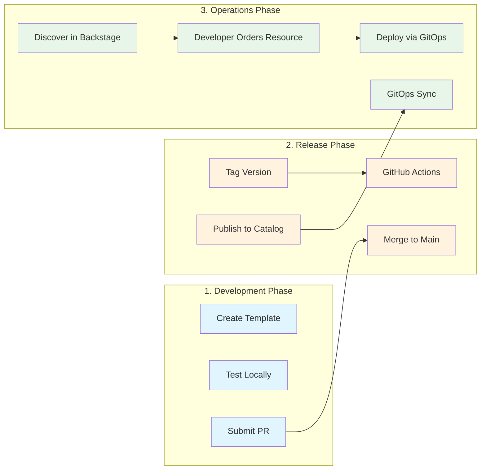

## Architecture Components

### Repository Structure

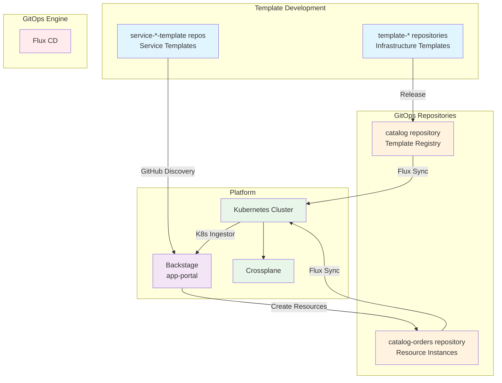

## Development Workflows

### Local Development Workflow

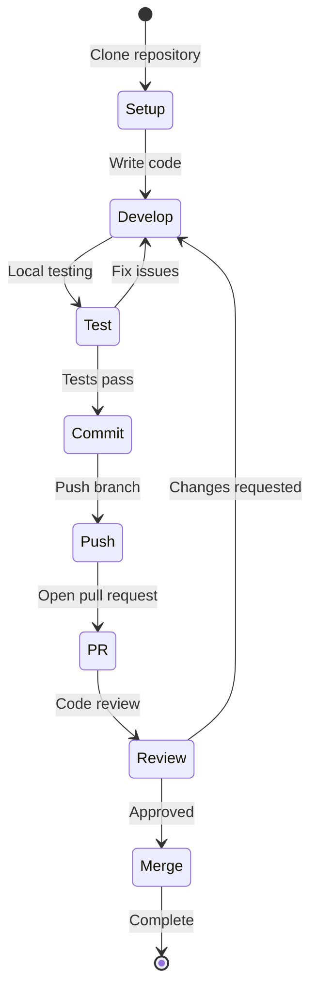

### Template Development Process

Developers follow this process for creating new templates:

1. **Infrastructure Templates** (`template-*`)
   - Write XRD (API definition)
   - Create Composition (implementation)
   - Add examples and documentation
   - Test with local Crossplane

2. **Service Templates** (`service-*-template`)
   - Create Backstage template.yaml
   - Add scaffolding content
   - Configure GitHub Actions
   - Test with local Backstage

## Release Workflows

### GitHub Actions Automation

GitHub Actions serves as the automation engine for the release process:

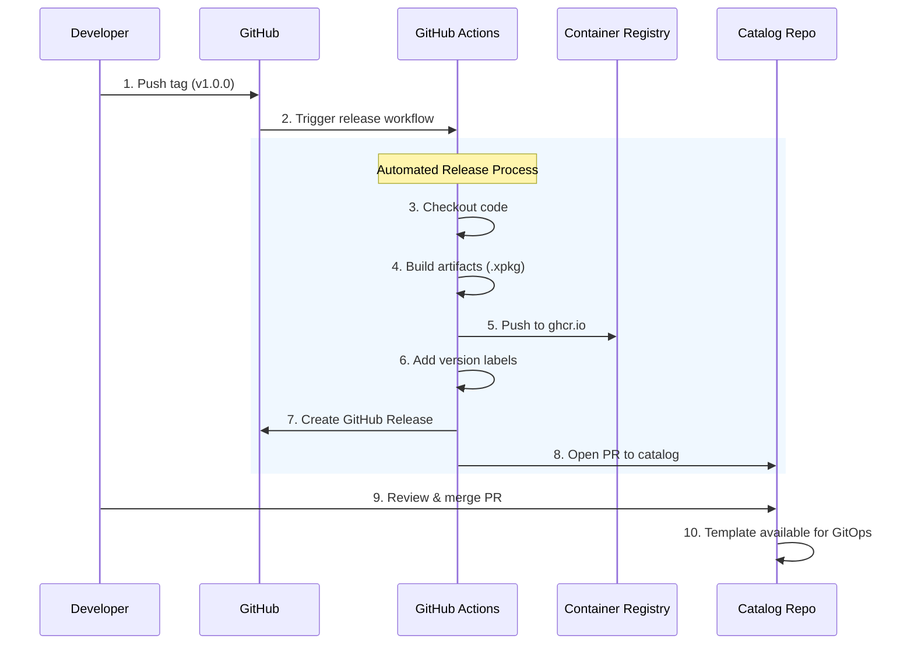

The GitHub Actions workflow (`/.github/workflows/release.yaml`) handles:
- Building Crossplane configuration packages
- Publishing container images
- Versioning templates
- Creating releases
- Updating the catalog repository

## GitOps Deployment Workflows

### 1. Template Release Flow

This flow shows how infrastructure templates are developed, released, and made available in the cluster.

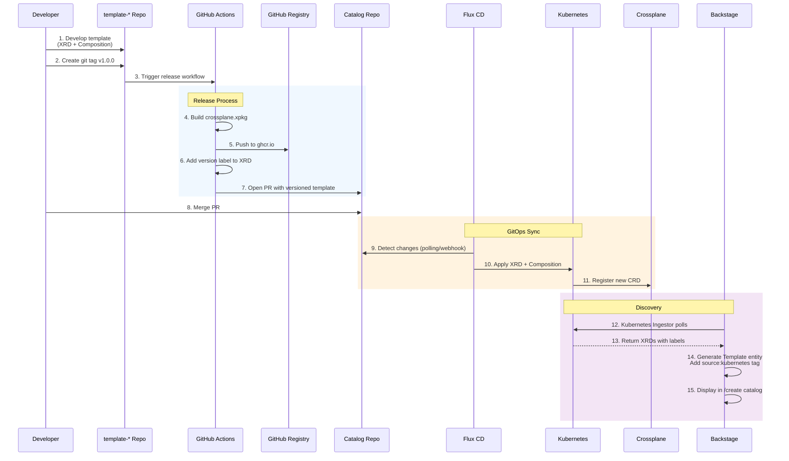

### 2. Resource Ordering Flow

This flow shows how developers use Backstage to create infrastructure resources that are deployed via GitOps.

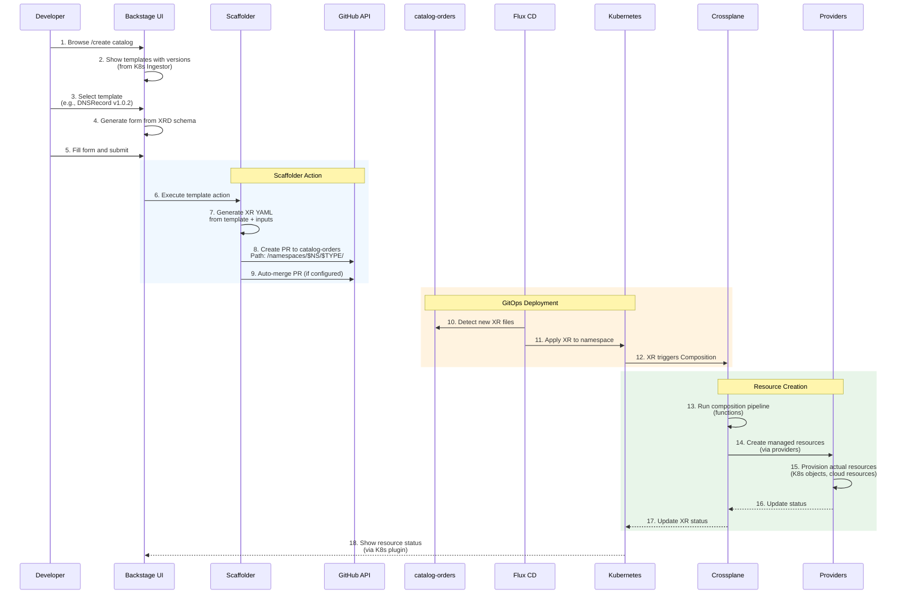

### 3. Multi-Repository Pattern

```mermaid
graph LR
    subgraph "Template Repositories"
        T1[template-dns-record]
        T2[template-cloudflare-dnsrecord]
        T3[template-whoami]
        T4[template-namespace]
    end
    
    subgraph "Catalog Repository"
        direction TB
        C1[templates/<br/>├── dns-record/<br/>│   ├── xrd.yaml<br/>│   └── composition.yaml<br/>├── cloudflare-dnsrecord/<br/>│   ├── xrd.yaml<br/>│   └── composition.yaml<br/>└── ...]
    end
    
    subgraph "Catalog-Orders Repository"
        direction TB
        O1[namespaces/<br/>├── team-alpha/<br/>│   ├── dns-records/<br/>│   │   ├── api-dns.yaml<br/>│   │   └── web-dns.yaml<br/>│   └── applications/<br/>│       └── frontend.yaml<br/>├── team-beta/<br/>│   └── dns-records/<br/>       └── backend-dns.yaml]
    end
    
    subgraph "Kubernetes Cluster"
        direction TB
        K1[XRDs<br/>(API Definitions)]
        K2[Compositions<br/>(Implementations)]
        K3[XRs<br/>(Resource Instances)]
    end
    
    T1 -->|Release| C1
    T2 -->|Release| C1
    T3 -->|Release| C1
    T4 -->|Release| C1
    
    C1 -->|Flux Sync| K1
    C1 -->|Flux Sync| K2
    O1 -->|Flux Sync| K3
    
    style T1 fill:#e1f5fe
    style T2 fill:#e1f5fe
    style T3 fill:#e1f5fe
    style T4 fill:#e1f5fe
    style C1 fill:#fff3e0
    style O1 fill:#fff3e0
    style K1 fill:#e8f5e9
    style K2 fill:#e8f5e9
    style K3 fill:#e8f5e9
```

## Detailed Component Interactions

### Backstage Integration Points

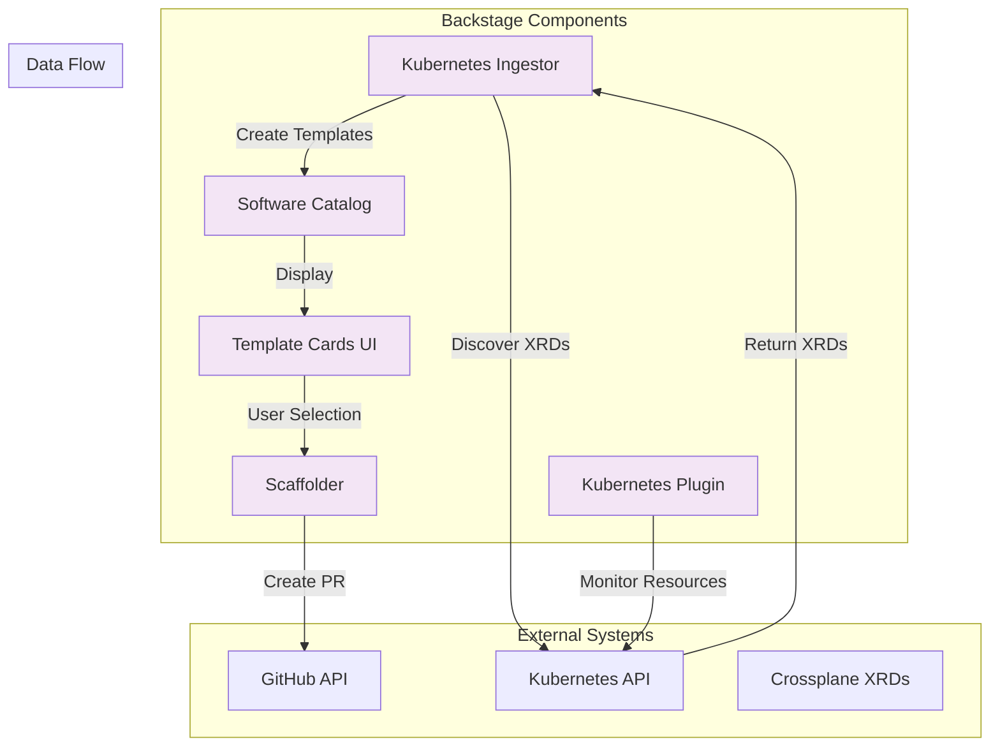

### Flux GitOps Watchers

```mermaid
graph LR
    subgraph "Flux Sources"
        S1[catalog GitRepository]
        S2[catalog-orders GitRepository]
    end
    
    subgraph "Flux Kustomizations"
        K1[catalog-sync<br/>path: ./templates]
        K2[orders-sync<br/>path: ./namespaces]
    end
    
    subgraph "Applied Resources"
        R1[XRDs & Compositions<br/>(Template Definitions)]
        R2[XRs<br/>(Resource Instances)]
    end
    
    S1 -->|Watch| K1
    S2 -->|Watch| K2
    K1 -->|Apply| R1
    K2 -->|Apply| R2
    
    style S1 fill:#ffebee
    style S2 fill:#ffebee
    style K1 fill:#ffebee
    style K2 fill:#ffebee
```

## End-to-End Workflow Examples

### Example 1: Creating a DNS Record

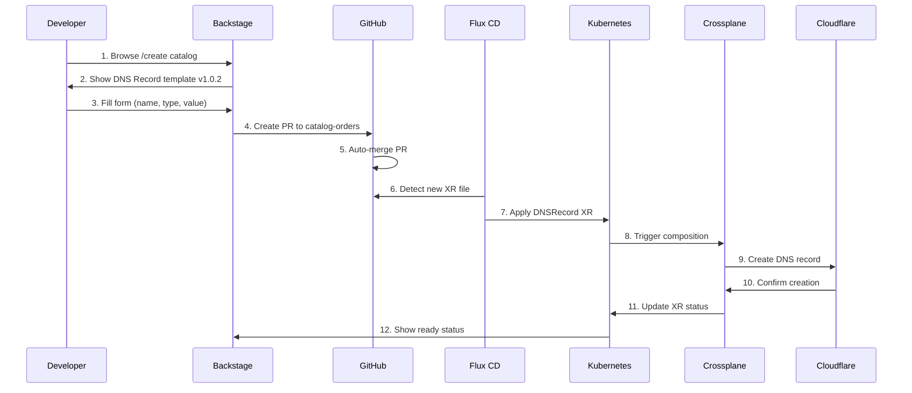

### Example 2: Deploying an Application

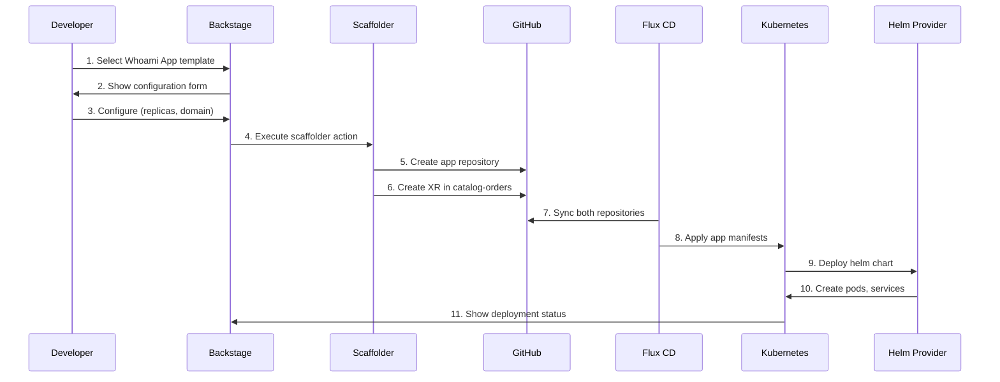

## Configuration Examples

### Flux Configuration for Catalog

```yaml
# Flux GitRepository for catalog
apiVersion: source.toolkit.fluxcd.io/v1
kind: GitRepository
metadata:
  name: catalog
  namespace: flux-system
spec:
  interval: 1m
  url: https://github.com/open-service-portal/catalog
  ref:
    branch: main

---
# Flux Kustomization for syncing templates
apiVersion: kustomize.toolkit.fluxcd.io/v1
kind: Kustomization
metadata:
  name: catalog-sync
  namespace: flux-system
spec:
  interval: 5m
  sourceRef:
    kind: GitRepository
    name: catalog
  path: "./templates"
  prune: true
```

### Flux Configuration for Orders

```yaml
# Flux GitRepository for catalog-orders
apiVersion: source.toolkit.fluxcd.io/v1
kind: GitRepository
metadata:
  name: catalog-orders
  namespace: flux-system
spec:
  interval: 1m
  url: https://github.com/open-service-portal/catalog-orders
  ref:
    branch: main

---
# Flux Kustomization for syncing XRs
apiVersion: kustomize.toolkit.fluxcd.io/v1
kind: Kustomization
metadata:
  name: orders-sync
  namespace: flux-system
spec:
  interval: 1m
  sourceRef:
    kind: GitRepository
    name: catalog-orders
  path: "./namespaces"
  prune: false  # Don't auto-delete user resources
```

### Backstage Scaffolder Template

```yaml
apiVersion: scaffolder.backstage.io/v1beta3
kind: Template
metadata:
  name: crossplane-resource-order
  title: Order Crossplane Resource
spec:
  type: crossplane-xr
  steps:
    - id: generate
      name: Generate XR
      action: fetch:template
      input:
        url: ./content
        values:
          name: ${{ parameters.name }}
          namespace: ${{ parameters.namespace }}
          spec: ${{ parameters.spec }}
          
    - id: publish
      name: Publish to GitOps
      action: publish:github:pr
      input:
        repoUrl: github.com?owner=open-service-portal&repo=catalog-orders
        branchName: order-${{ parameters.name }}-${{ Date.now() }}
        title: "New resource: ${{ parameters.name }}"
        description: |
          Creating ${{ parameters.kind }} resource
          Namespace: ${{ parameters.namespace }}
        targetPath: namespaces/${{ parameters.namespace }}/${{ parameters.type }}
```

## Versioning Strategy

### Template Versioning Flow

```mermaid
graph TB
    subgraph "Version Sources"
        GT[Git Tag<br/>v1.2.3]
        GR[GitHub Release<br/>Release Notes]
    end
    
    subgraph "Version Propagation"
        XRD[XRD Label<br/>openportal.dev/version: 1.2.3]
        PKG[Package Version<br/>ghcr.io/template:v1.2.3]
        CAT[Catalog Entry<br/>With version label]
    end
    
    subgraph "Version Display"
        ING[K8s Ingestor<br/>Reads label]
        UI[Backstage UI<br/>Shows "Template v1.2.3"]
    end
    
    GT --> GR
    GR --> XRD
    GR --> PKG
    XRD --> CAT
    CAT --> ING
    ING --> UI
    
    style GT fill:#e1f5fe
    style GR fill:#e1f5fe
    style XRD fill:#fff3e0
    style PKG fill:#fff3e0
    style CAT fill:#fff3e0
    style ING fill:#f3e5f5
    style UI fill:#f3e5f5
```

## Namespace Organization

### catalog-orders Repository Structure

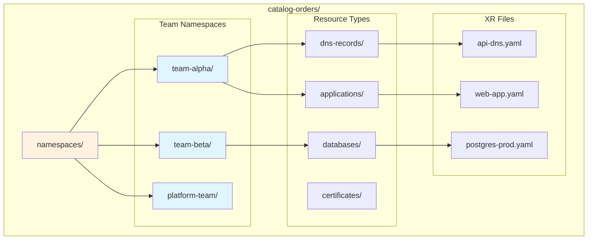

## Crossplane v2 Architecture

### Namespaced XR Flow (No Claims)

```mermaid
graph LR
    subgraph "Developer Experience"
        DEV[Developer]
        XR[XR<br/>(Direct Resource)]
    end
    
    subgraph "Crossplane Processing"
        COMP[Composition]
        FUNC[Pipeline Functions]
        MR[Managed Resources]
    end
    
    subgraph "Infrastructure"
        PROV[Providers]
        RES[Actual Resources]
    end
    
    DEV -->|Creates| XR
    XR -->|Triggers| COMP
    COMP -->|Runs| FUNC
    FUNC -->|Generates| MR
    MR -->|Instructs| PROV
    PROV -->|Creates| RES
    
    style XR fill:#e8f5e9
    style COMP fill:#e8f5e9
    style FUNC fill:#e8f5e9
    
    Note1[No Claim needed!<br/>Direct XR in namespace]
    Note1 -.-> XR
    
    style Note1 fill:#ffffcc
```

## Error Handling and Recovery

### GitOps Error Recovery Flow

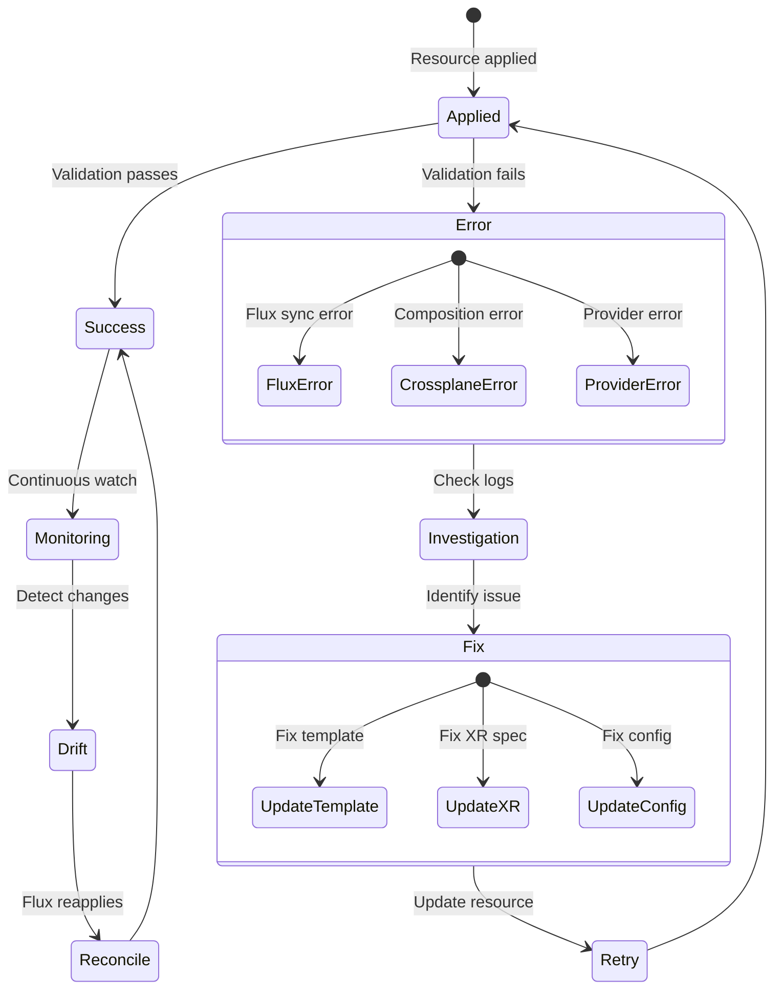

## Monitoring and Observability

### Status Flow

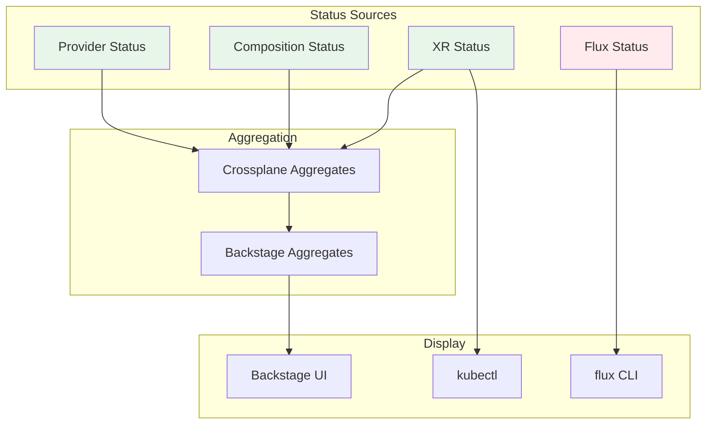

## Best Practices

### 1. Template Development
- Always use Crossplane v2 with namespaced XRs
- Include comprehensive examples
- Add proper RBAC permissions
- Use semantic versioning

### 2. GitOps Repository Management
- Keep catalog organized by template type
- Use clear directory structure in catalog-orders
- Enable branch protection on main
- Set up automated PR validation

### 3. Backstage Integration
- Ensure XRDs have required labels
- Keep Kubernetes Ingestor polling interval reasonable
- Cache template data appropriately
- Provide clear template descriptions

### 4. Production Considerations
- Pin provider versions in production
- Implement proper RBAC for namespaces
- Set up monitoring and alerting
- Plan for disaster recovery

## Troubleshooting Guide

### Common Issues

1. **Template not appearing in Backstage**
   - Check XRD has `terasky.backstage.io/generate-form: "true"` label
   - Verify Flux has synced the template
   - Check Kubernetes Ingestor logs
   - Ensure XRD is valid and applied

2. **Resource creation fails**
   - Check Flux sync status: `flux get all`
   - Verify XR syntax is correct
   - Check Crossplane composition logs
   - Ensure providers are healthy

3. **Version not showing**
   - Verify `openportal.dev/version` label on XRD
   - Check release workflow completed
   - Ensure catalog has latest version
   - Force refresh in Backstage

## Workflow Integration Points

### How Workflows Connect

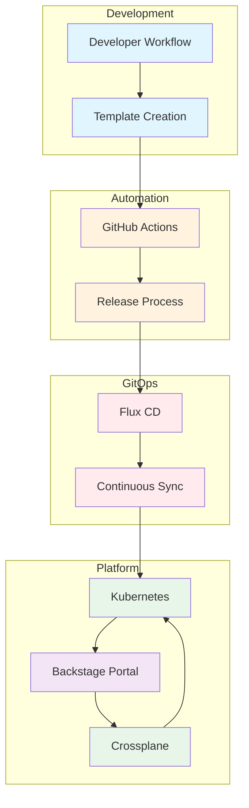

## Summary

The Open Service Portal workflow orchestrates multiple processes to deliver a complete platform experience:

### 1. **Development Workflows**
   - Local development with immediate feedback
   - Template creation following standards
   - PR-based collaboration and review
   - Testing before release

### 2. **Release Automation**
   - GitHub Actions automate the release pipeline
   - Semantic versioning throughout
   - Automatic catalog updates
   - Container registry publishing

### 3. **GitOps Deployment**
   - Flux ensures desired state
   - Two-repository pattern (catalog + orders)
   - Continuous reconciliation
   - Drift detection and correction

### 4. **Platform Integration**
   - Backstage provides the developer portal
   - Kubernetes hosts all resources
   - Crossplane manages infrastructure
   - Everything connected via APIs

### Key Benefits

1. **Developer Experience**
   - Self-service infrastructure provisioning
   - Visual forms generated from templates
   - Real-time status monitoring
   - No direct kubectl needed

2. **Operational Excellence**
   - Every change tracked in Git
   - Automated deployment pipeline
   - Consistent environments
   - Rollback capabilities

3. **Governance & Compliance**
   - Template approval process
   - RBAC at every level
   - Audit trail in Git history
   - Policy enforcement via Crossplane

4. **Scalability**
   - Multi-team support via namespaces
   - Template reusability
   - Automated processes reduce toil
   - GitOps scales with Git

This comprehensive workflow enables teams to move fast while maintaining safety and control, bridging the gap between development velocity and operational stability.