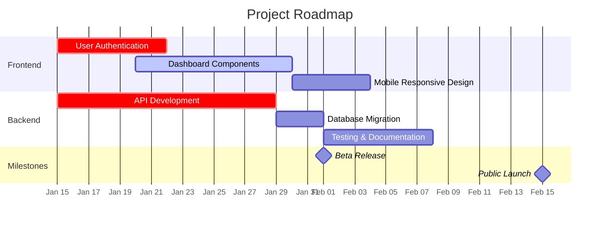
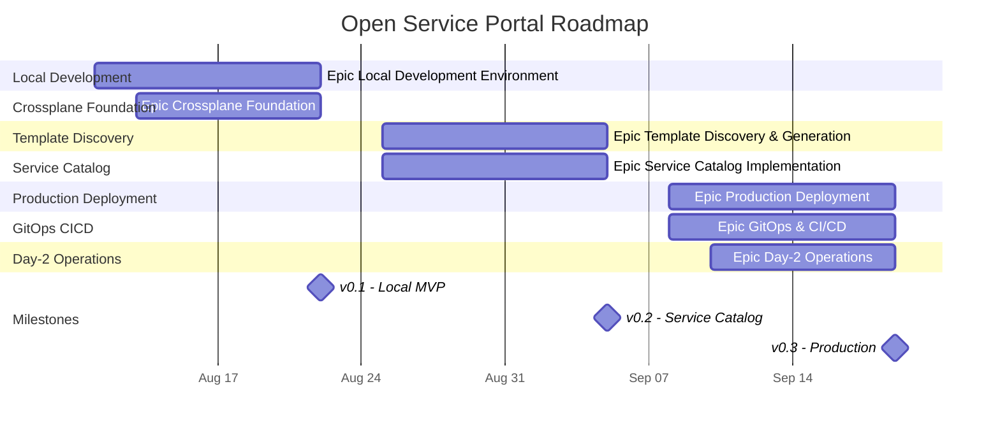

# 🗓️ Roadmap Generator

A sophisticated GitHub Action that automatically generates beautiful Mermaid Gantt charts from GitHub Projects v2 data and updates your repository's README.md with a live roadmap visualization.

## ✨ Features

- **Automated Schedule**: Runs every Friday at noon UTC via GitHub Actions
- **GitHub Projects v2 Integration**: Queries the latest GraphQL API with full custom field support
- **Beautiful Visualizations**: Generates Mermaid Gantt charts with colors, sections, and milestones
- **Smart Data Processing**: Handles missing dates, priorities, and dependencies intelligently  
- **Epic Organization**: Groups tasks by epic/feature area for better visual organization
- **Progress Tracking**: Shows completion status and project statistics
- **Edge Case Handling**: Gracefully handles missing data and provides fallbacks

## 🚀 Quick Start

### Prerequisites

1. **GitHub Token**: Create a personal access token with the following scopes:
   - `repo` (for private repositories)
   - `project` (to read GitHub Projects v2)
   - `read:org` (to access organization projects)

2. **GitHub Project**: Ensure you have a GitHub Projects v2 board set up with issues/PRs

### Installation

1. **Add the workflow file** to your repository at `.github/workflows/update-roadmap.yml`:

```yaml
name: Update Roadmap Visualization

on:
  schedule:
    # Runs every Friday at noon UTC (12:00)
    - cron: '0 12 * * 5'
  workflow_dispatch: # Allow manual triggering

permissions:
  contents: write
  issues: read
  projects: read

jobs:
  update-roadmap:
    runs-on: ubuntu-latest
    name: Generate and Update Roadmap
    
    steps:
      - name: Checkout Repository
        uses: actions/checkout@v4
        with:
          token: ${{ secrets.GITHUB_TOKEN }}

      - name: Setup Node.js
        uses: actions/setup-node@v4
        with:
          node-version: '20'
          cache: 'npm'
          cache-dependency-path: 'scripts/roadmap-generator/package-lock.json'

      - name: Install Dependencies
        working-directory: scripts/roadmap-generator
        run: npm ci

      - name: Generate Roadmap
        working-directory: scripts/roadmap-generator
        run: npm run generate
        env:
          GITHUB_TOKEN: ${{ secrets.GITHUB_TOKEN }}
          GITHUB_REPOSITORY: ${{ github.repository }}
          PROJECT_ID: 1
          ORGANIZATION: 'your-org-name'

      - name: Commit and Push Changes
        run: |
          git config --local user.name "github-actions[bot]"
          git config --local user.email "41898282+github-actions[bot]@users.noreply.github.com"
          git add README.md
          git commit -m "📊 Update roadmap visualization (automated)" || exit 0
          git push
```

2. **Copy the script files** to your repository:
   - Copy all files from this `scripts/roadmap-generator/` directory to your repo
   - Run `npm install` in the `scripts/roadmap-generator/` directory

3. **Configure your organization and project**:
   - Update the `ORGANIZATION` environment variable in the workflow
   - Update the `PROJECT_ID` to match your GitHub Project number

### Manual Testing

Test the generator locally before setting up automation:

```bash
cd scripts/roadmap-generator
npm install

# Set environment variables
export GITHUB_TOKEN="your-github-token"
export ORGANIZATION="your-org-name"
export PROJECT_ID="1"
export VERBOSE="true"

# Run in dry-run mode (doesn't modify files)
export DRY_RUN="true"
npm run generate

# Run for real
unset DRY_RUN
npm run generate
```

## 📊 GitHub Projects v2 Setup

For the best results, configure your GitHub Project with these custom fields:

### Recommended Custom Fields

| Field Name | Type | Purpose | Example Values |
|------------|------|---------|----------------|
| **Epic** | Single select | Group related tasks | Frontend, Backend, API, Documentation |
| **Priority** | Single select | Task importance | Critical, High, Medium, Low |
| **Status** | Single select | Current progress | To Do, In Progress, In Review, Done |
| **Start Date** | Date | When work begins | 2024-01-15 |
| **Due Date** | Date | Target completion | 2024-02-01 |
| **Story Points** | Number | Size estimate | 1, 2, 3, 5, 8, 13 |

### Field Mapping

The generator automatically maps common field names to standard properties:

- **Epic/Theme**: `Epic`, `epic`, `Epic/Theme`, `Feature Area`
- **Priority**: `Priority`, `priority`, `Urgency`, `Importance`  
- **Status**: `Status`, `status`, `State`, `Progress`
- **Dates**: `Start Date`, `Due Date`, `Target Date`, `End Date`
- **Estimation**: `Story Points`, `Points`, `Estimation`, `Effort`, `Size`

## 🎨 Customization

### Environment Variables

Configure the generator with these environment variables:

| Variable | Default | Description |
|----------|---------|-------------|
| `GITHUB_TOKEN` | *required* | GitHub personal access token |
| `ORGANIZATION` | *required* | GitHub organization name |
| `PROJECT_ID` | `1` | GitHub Project number |
| `README_PATH` | `README.md` | Path to README file to update |
| `MAX_ITEMS` | `50` | Maximum number of items to include |
| `DRY_RUN` | `false` | Preview mode - doesn't modify files |
| `VERBOSE` | `false` | Enable detailed logging |

### Chart Appearance

The generator uses a sophisticated color scheme:

- **Priority Colors**: Critical (Red), High (Orange), Medium (Blue), Low (Purple)
- **Status Indicators**: Done (Green), In Progress (Blue), To Do (Gray)
- **Epic Sections**: Each epic gets its own section with distinct colors
- **Milestones**: Diamond markers for important deadlines

### Example Output

The generator creates a Mermaid Gantt chart like this:



## 🔧 Advanced Usage

### Custom README Integration

The generator looks for special markers in your README.md:

```markdown
## 🗓️ Project Roadmap

<!-- ROADMAP-START -->
## 🗓️ Project Roadmap

This roadmap is automatically generated from our GitHub Project and updated every Friday.




## 📊 Project Statistics

- **Total Epics:** 16
- **Completed:** 0 (0%)  
- **In Progress:** 0
- **To Do:** 0
- **Critical Priority:** 0
- **High Priority:** 0

### 🔗 Quick Links
- [📋 Project Board](https://github.com/orgs/open-service-portal/projects/1)
- [🗺️ Interactive Roadmap View](https://github.com/orgs/open-service-portal/projects/1/views/3)
- [📊 Table View](https://github.com/orgs/open-service-portal/projects/1/views/1)
- [🎯 Kanban Board](https://github.com/orgs/open-service-portal/projects/1/views/2)

*Last updated: Aug 08, 2025 at 13:34 UTC*

---
*🤖 This roadmap is automatically generated from [GitHub Projects](https://github.com/orgs/open-service-portal/projects/1) every Friday at 16:00 UTC*  
*View the [interactive roadmap](https://github.com/orgs/open-service-portal/projects/1/views/3) for real-time updates*  
*Generated on: Friday, August 8, 2025*
<!-- ROADMAP-END -->
```

If these markers don't exist, the generator will add them automatically.

### Error Handling

The generator includes comprehensive error handling:

- **Missing Data**: Automatically estimates missing dates based on priority and creation date
- **API Failures**: Retries requests and provides clear error messages
- **Invalid Tokens**: Guides you through permission requirements
- **Empty Projects**: Handles projects with no items gracefully

### Data Quality Analysis

The generator analyzes your project data and provides recommendations:

```
📊 Data Quality Analysis:
  Items with dates: 15/20 (75%)
  Items with epics: 18/20 (90%)
  Items with priority: 20/20 (100%)
  Items with status: 17/20 (85%)
  ⚠️  3 items have estimated due dates
```

## 🛠️ Development

### Local Development

```bash
# Clone the repository
git clone <your-repo>
cd scripts/roadmap-generator

# Install dependencies
npm install

# Run type checking
npm run type-check

# Development with inspection
npm run dev
```

### Project Structure

```
scripts/roadmap-generator/
├── src/
│   ├── index.js              # Main application entry point
│   ├── github-client.js      # GitHub GraphQL API client
│   ├── data-processor.js     # Raw data processing and enrichment
│   ├── mermaid-generator.js  # Mermaid chart generation
│   ├── readme-updater.js     # README.md file manipulation
│   └── types.js             # Type definitions and JSDoc
├── package.json             # Dependencies and scripts
├── tsconfig.json           # TypeScript configuration
└── README.md               # This documentation
```

### Architecture

The generator follows a modular architecture:

1. **GitHubClient**: Handles all GitHub GraphQL API interactions
2. **DataProcessor**: Transforms raw API data into structured format
3. **MermaidGenerator**: Creates Mermaid Gantt chart syntax
4. **ReadmeUpdater**: Manages README.md file updates
5. **Main Application**: Orchestrates the entire process

## 📚 Examples

### Basic Organization Profile

For an organization profile README, set up the action to run on your `.github` repository:

1. Create `.github` repository in your organization
2. Add the workflow to `.github/workflows/update-roadmap.yml`
3. Set `PROJECT_ID` to your main organization project
4. The README.md in this repo becomes your organization profile

### Multi-Project Setup

To combine multiple projects into one roadmap:

```javascript
// In src/index.js, modify the fetchProjectData method
async fetchProjectData() {
  const projects = [1, 2, 3]; // Multiple project IDs
  this.rawItems = [];
  
  for (const projectId of projects) {
    const project = await this.githubClient.getProject(this.config.organization, projectId);
    const items = await this.githubClient.getProjectItems(project.id);
    this.rawItems.push(...items);
  }
}
```

### Custom Field Mappings

To handle specific field names in your organization:

```javascript
// In src/data-processor.js, modify FIELD_MAPPINGS
this.FIELD_MAPPINGS = {
  epic: ['Epic', 'Feature Area', 'Workstream'], // Add your custom names
  priority: ['Priority', 'Business Value', 'Urgency'],
  // ... other mappings
};
```

## 🤝 Contributing

We welcome contributions! Please:

1. Fork the repository
2. Create a feature branch
3. Add tests for new functionality
4. Submit a pull request

### Common Improvements

- Add support for dependencies between tasks
- Implement project templates for different use cases  
- Add more chart themes and color schemes
- Support for multiple README files
- Integration with other project management tools

## 📝 License

This project is licensed under the MIT License - see the [LICENSE](LICENSE) file for details.

## 🙏 Acknowledgments

- Built with [Octokit GraphQL](https://github.com/octokit/graphql.js) for GitHub API integration
- Uses [Mermaid](https://mermaid-js.github.io/) for beautiful diagram generation
- Inspired by the GitHub Projects v2 GraphQL API capabilities
- Thanks to the open-source community for excellent examples and documentation

---

*🤖 This README is maintained alongside the automated roadmap generation system*